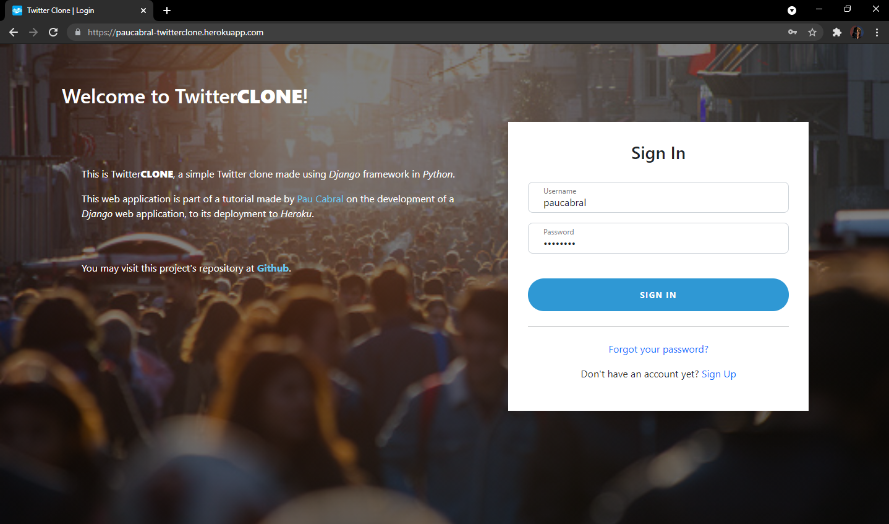

# Twitter<b>Clone</b>

**Author**: Pau Cabral 

This is Twitter**CLONE**, a simple Twitter clone made using _Django_ framework in **Python**. 

This tutorial tackles the development of a _Django_ web application up to its deployment to **Heroku**.

 

Check out the tutorial from my blog **[here](https://paucabral.github.io/blog/twitter-clone/)**.
