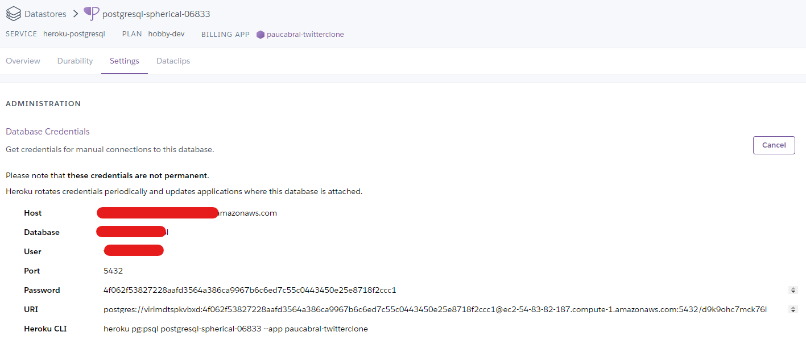
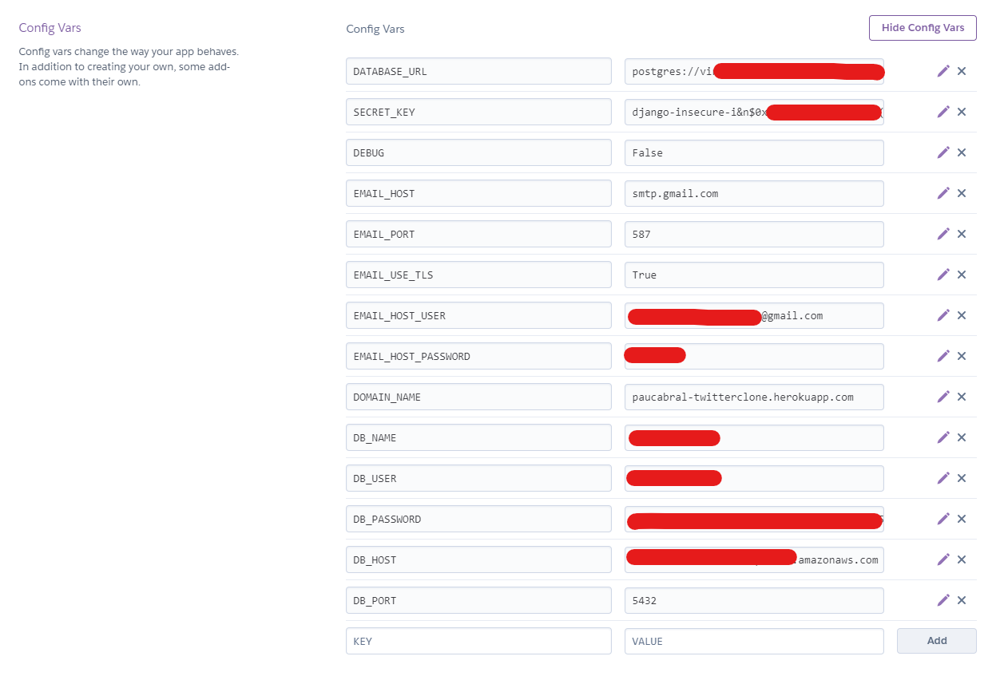
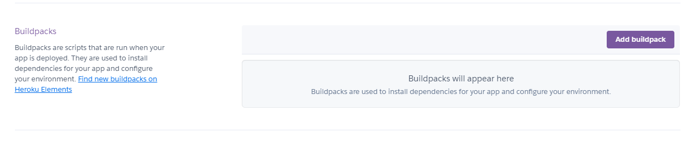
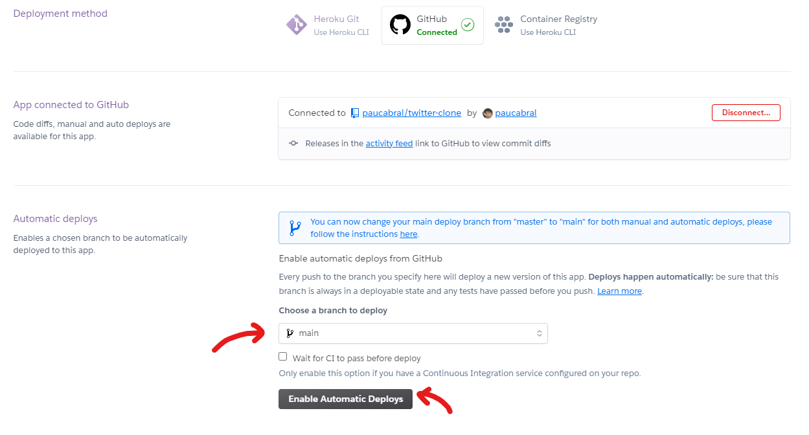
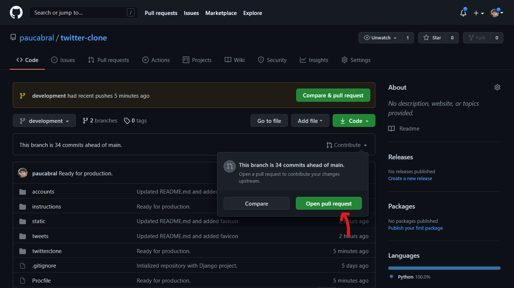
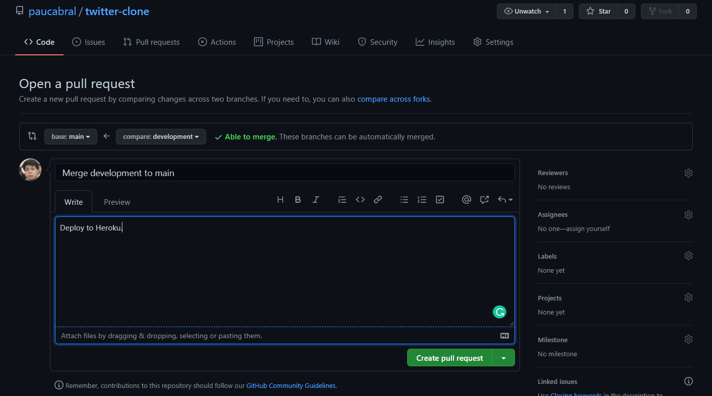
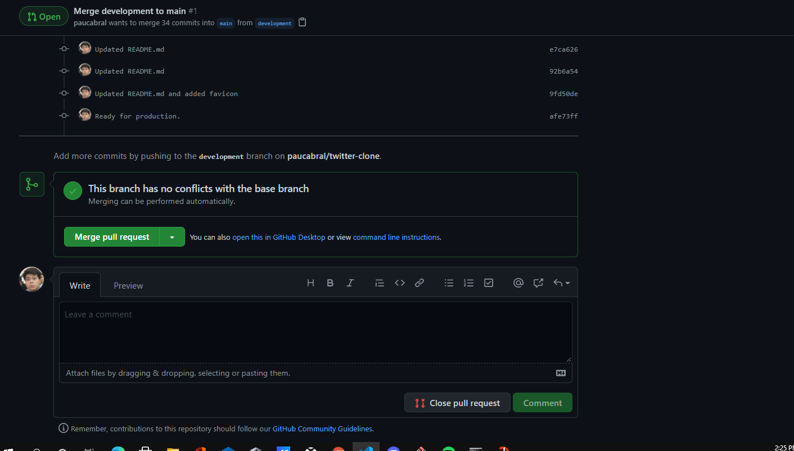
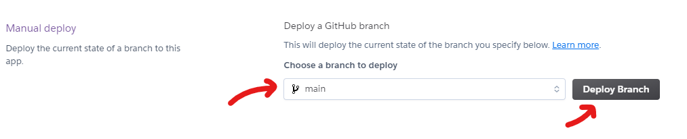

# Twitter<b>Clone</b>

### **Author**: Pau Cabral<br>

<br>

This is Twitter**CLONE**, a simple Twitter clone made using Django framework in Python.

This tutorial tackles the development of a Django web application up to its deployment to Heroku.

<br>

# Setting up the local machine

1. Install the latest version of **Python** and **Git**.
2. In a command line, check if `pip` was installed.
   ```bash
   $ pip --version
   ```
   _Note: For Windows users, you may need to add `pip` into your PATH from the environmental variables._
3. Install the `virtualenvwrapper` using `pip`. This would allow us to create a virtual environment for our project.<br>
   _For Windows_:
   ```bash
   $ pip install virtualenvwrapper-win
   ```
   _For Linux/UNIX_:
   ```bash
   $ pip install virtualenvwrapper
   ```
   <br>

# Setting up the environment and Django

1. Create a virtual environment to be used for the project. This will make an isolated **Python** environment free of other libraries and packages. You may name it as you desire.
   ```bash
   $ mkvirtualenv twtclone
   ```
   _Note: In this case, the name of the environment was set to "twtclone"_.
2. You should notice that the your terminal now has a modified prompt which looks like the following:
   ```bash
   (twtclone)$
   ```
   _Note: After exiting your terminal, the virtual environment would naturally be deactivated upon your next launch or another spawn of terminal. You do not need to recreate the virtual environment every project. To use the created virtual environment again, you may use the following command:_
   ```bash
   $ workon twtclone
   ```
3. Install **Django** using `pip`.
   ```bash
   (twtclone)$ pip install django
   ```
4. Once installed, you may issue the `django-admin` command to check. You should see a list of commands that can be issued.
   ```bash
   (twtclone)$ django-admin
   ```
5. Create your project using the following command.

   ```bash
   (twtclone)$ django-admin startproject twitterclone
   ```

   _Note: In this case, the name of the project was **twitterclone**. General rule for naming convention is to ensure that the name has no spaces nor non-alphanumeric characters._

   The path of your project should look similar to one below:

   ```
   twitter-clone/
   |__ twitter-clone/
   |   |__ __pycache__/
   |   |__ __init__.py
   |   |__ asgi.py
   |   |__ settings.py
   |   |__ urls.py
   |   |__ wsgi.py
   |__ db.sqlite3
   |__ manage.py
   ```

6. Run the server using the following command:

   ```bash
   (twtclone)$ python manage.py runserver
   ```

   You should be able to access the page on your web browser at http://127.0.0.1:8000. You may stop serving it using `Ctrl + C`.

   <br>

# Setup .env file for environmental variables

1. To properly integrate environmental variables in a **Django** project, additional dependency must be installed. Using `pip`, install `python-decouple`.
   ```bash
   (twtclone)$ pip install python-decouple
   ```
2. Inside your project directory, enter the subdirectory and create a .env file. For now, add the following lines.
   ```
   SECRET_KEY=
   ```
3. Open `settings.py` from inside the project subdirectory.
4. Just below the `from from pathlib import Path` line, import `config` from the `decouple` library.
   ```python
   from pathlib import Path
   from decouple import config # Insert the code here.
   ```
5. Copy the value of the variable `SECRET_KEY`.
   ```python
   SECRET_KEY = 'django-insecure-i&n$0x7e_(4jeo&!tbfq%*yk(t-486lt^nnrzqay9+2odd(y#p'
   ```
6. Paste the value to the `SECRET_KEY` variable in the `.env` file.
   ```
   SECRET_KEY=django-insecure-i&n$0x7e_(4jeo&!tbfq%*yk(t-486lt^nnrzqay9+2odd(y#p
   ```
   _Note: Make sure that there are no spaces in between the variable name, equal sign, and the value itself._
7. Go back to the `settings.py` file and replace the value of `SECRET_KEY` by referencing the environmental variable assigned to it using the `config` function from the `decouple` library.
   ```python
   SECRET_KEY = config('SECRET_KEY')
   ```
8. Go ahead as well on modifying the `DEBUG` variable.<br>
   _settings.py_
   ```python
   DEBUG = config('DEBUG', default=True, cast=bool)
   ```
   _.env_
   ```
   DEBUG=True
   ```
   _Note: During development, always set `DEBUG` to `True` to see debug messages. Set it only to `False` when testing or deploying for production._
9. Try to run the server again. You should not experience any problem.

   ```bash
   (twtclone)$ python manage.py runserver
   ```

   The updated path of your project should look similar to one below:

   ```
   twitter-clone/
   |__ twitter-clone/
   |   |__ __pycache__/
   |   |__ __init__.py
   |   |__ .env
   |   |__ asgi.py
   |   |__ settings.py
   |   |__ urls.py
   |   |__ wsgi.py
   |__ db.sqlite3
   |__ manage.py
   ```

   <br>

# Setting up the repository

1. Create a new repository from your **Github** account.<br>
   _Note: Make sure to intialize an empty repository._
2. Go inside the directory of your **Django** project.
   ```bash
   $ cd /path/to/cloned/repository/
   ```
3. Initalize the repository from your local machine.
   ```bash
   $ git init
   ```
4. Before proceeding with the development, setup a `.gitignore` file on the root directory of the project (same directory as the `manage.py` file) with the following lines inside:

   ```
   .env
   *.log
   *.pot
   *.pyc
   __pycache__/
   local_settings.py
   db.sqlite3
   db.sqlite3-journal
   media
   ```

   The updated path of your project locally should look similar to one below:

   ```
   twitter-clone/
   |__ twitter-clone/
   |   |__ __pycache__/
   |   |__ __init__.py
   |   |__ .env
   |   |__ asgi.py
   |   |__ settings.py
   |   |__ urls.py
   |   |__ wsgi.py
   |__ .gitignore
   |__ db.sqlite3
   |__ manage.py
   ```

5. Track the files and do an an intial commit.
   ```bash
   $ git add .
   $ git commit -m "Intialized repository with Django project."
   ```
6. Configure remote origin as the **Github** repository your created.
   ```bash
   $ git branch -M main
   $ git remote add origin https://github.com/<your-github-user>/<your-repository>.git
   ```
7. Push the project the `main` branch for now. You should see the files in your `master` branch except those declared inside `.gitignore`.
   ```bash
   $ git push -u origin main
   ```
   However, since some files are included in `.gitignore`, the updated path your remote project repository should look similar to one below instead:
   ```
   twitter-clone/
   |__ twitter-clone/
   |   |__ __init__.py
   |   |__ asgi.py
   |   |__ settings.py
   |   |__ urls.py
   |   |__ wsgi.py
   |__ .gitignore
   |__ manage.py
   ```
8. Create a new branch named `development` and checkout to it. This will be your dedicated branch during active development. You may add, commit, and push to this branch during the course of the development.
   ```bash
   $ git branch development
   $ git checkout development
   ```
   <br>

# Creating Apps

In **Django**, _apps_ can be used to manage multiple pages with specific features. In this project, we will be adding the _apps_: _accounts_ and _tweets_.

1. In the root project directory, create the _accounts_ app using the following command:
   ```bash
   (twtclone)$ python manage.py startapp accounts
   ```
2. Open the `settings.py` and add `accounts` on the list of `INSTALLED_APPS`.

   ```python
   # Application definition

   INSTALLED_APPS = [
      'django.contrib.admin',
      'django.contrib.auth',
      'django.contrib.contenttypes',
      'django.contrib.sessions',
      'django.contrib.messages',
      'django.contrib.staticfiles',
      'accounts',
   ]
   ```

3. You may proceed as well on creating the _tweets_ app with the following command:
   ```bash
   (twtclone)$ python manage.py startapp tweets
   ```
4. Likewise, add `tweets` as well on the list of `INSTALLED_APPS` inside `settings.py`.
   ```python
   INSTALLED_APPS = [
      'django.contrib.admin',
      'django.contrib.auth',
      'django.contrib.contenttypes',
      'django.contrib.sessions',
      'django.contrib.messages',
      'django.contrib.staticfiles',
      'accounts',
      'tweets',
   ]
   ```
5. Your local directory structure should now look similar to the one below:

   ```
   twitter-clone/
   |__ accounts/
   |   |__ __pycache__/
   |   |__ migrations/
   |   |__ __init__.py
   |   |__ admin.py
   |   |__ apps.py
   |   |__ models.py
   |   |__ tests.py
   |   |__ views.py
   |__ tweets/
   |   |__ __pycache__/
   |   |__ migrations/
   |   |__ __init__.py
   |   |__ admin.py
   |   |__ apps.py
   |   |__ models.py
   |   |__ tests.py
   |   |__ views.py
   |__ twitter-clone/
   |   |__ __pycache__/
   |   |__ __init__.py
   |   |__ .env
   |   |__ asgi.py
   |   |__ settings.py
   |   |__ urls.py
   |   |__ wsgi.py
   |__ .gitignore
   |__ db.sqlite3
   |__ manage.py
   ```

   <br>

# Creating a super user account and exploring the Admin Panel

Django lets us create a super user account which has direct access to the built-in Admin Panel. It can be used to check and modify the entries in a database, as well as other features such modifying accounts.

1. To start, we need to do an initial migration. Inside the root project directory, run the following command:
   ```bash
   (twtclone)$ python manage.py migrate
   ```
2. After the built-in Django models are migrated, you may now proceed on creating a supersuser using the command below. Simply follow each prompt and provide the necessary information.

   ```bash
   (twtclone)$ python manage.py createsuperuser
   ```

3. Run your project and you may now explore the admin panel at http://127.0.0.1:8000/admin using the account you just created.
   ```bash
   (twtclone)$ python manage.py runserver
   ```
   <br>

# Creating preliminary views and associating each app with specific URL patterns

URL patterns set the paths to which each _app_ or specific functionality can be accessed as a webpage.

1. Open your base `urls.py` (in directory as `twitterclone/twitterclone`).
2. Open the _accounts_ subdirectory (twitterclone/accounts/) and create a file named `urls.py`.<br>
   Your local directory structure should now look similar to the one below:

   ```
   twitter-clone/
   |__ accounts/
   |   |__ __pycache__/
   |   |__ migrations/
   |   |__ __init__.py
   |   |__ admin.py
   |   |__ apps.py
   |   |__ models.py
   |   |__ tests.py
   |   |__ urls.py
   |   |__ views.py
   |__ tweets/
   |   |__ __pycache__/
   |   |__ migrations/
   |   |__ __init__.py
   |   |__ admin.py
   |   |__ apps.py
   |   |__ models.py
   |   |__ tests.py
   |   |__ views.py
   |__ twitter-clone/
   |   |__ __pycache__/
   |   |__ __init__.py
   |   |__ .env
   |   |__ asgi.py
   |   |__ settings.py
   |   |__ urls.py
   |   |__ wsgi.py
   |__ .gitignore
   |__ db.sqlite3
   |__ manage.py
   ```

3. Open the `views.py` inside the _accounts_ subdirectory and set the prelimnary _views_. The _views_ are basically the dedicated either classes or functions which serve as the backend of a functionalities found in a specific _Django_ webpage. In this case, we will be using class based views. For now, follow the code below. There are some commented explanations on the added lines as well.

   ```python
   from django.shortcuts import render
   from django.views import View # import the class View from Django library
   from django.http import HttpResponse # import the HttpResponse from Django library

   # Create your views here.

   class Login(View): # Created a Login ckass inherting the View class from the Django library
      def get(self, request, *args, **kwargs): # The get function is the dedicated backend for handling GET requests on a URL. GET requests are made when data is meant to be gathered and displayed in a webpage.
         return HttpResponse('login') # render the text: login upon get request.

      def post(self, request, *args, **kwargs): # The post function on the other hand handles the POST requests on a URL. POST requests are made when data is meant to sent or submitted to backend for processing or storing.
         pass # we will leave this empty for now
   ```

4. Open your previously created `urls.py` file and follow the code below. There are commented explanations below as well.

   ```python
   from django.urls import path # import path to set URL paths
   from . import views # import all the views inside the views.py for the accounts app

   urlpatterns = [
      path('', views.Login.as_view(), name='login'), # the path '/' or the root path was used as the path to locate the Login page.
   ]
   ```

5. The URL however, is still not accessible since it still not connected from the main `urls.py` in the base application. Update the `urlpatterns` in the base `urls.py` (`twitterclone/twitterclone/settings.py`) and add `'/'` as the dedicated path for _accounts_ app since we want the pages contained here (i.e. the landing/login page) to be accessed from the root URL. You may follow the code below and check the commented explanations for the added lines.

   ```python
   from django.contrib import admin
   from django.urls import path, include # import the necessary code to include urlpatterns from other apps.

   urlpatterns = [
      path('admin/', admin.site.urls),
      path('', include('accounts.urls')), # append the url patterns from accounts app to the base path. This way, all URL patterns can be accessible starting from the base url.
   ]
   ```

6. Now, the `'/'` directory can be viewed after running the project again. You should now see a new content when visiting http://127.0.0.1:8000/.
   ```bash
   (twtclone)$ python manage.py runserver
   ```
7. Proceed on doing the same steps for the _tweets_ app. This time however, the tweet app views and all its URL is meant to be accessible in `/tweets` directory. For now create a view dedicated to view all tweets with a class named `AllTweets`. Proceed on creating a `urls.py` for it as well.<br>

   _twitterclone/tweets/views.py_.

   ```python
   from django.shortcuts import render
   from django.views import View
   from django.http import HttpResponse

   # Create your views here.


   class AllTweets(View):
      def get(self, request, *args, **kwargs):
         return HttpResponse('This is page dedicated to view all tweets.')

      def post(self, request, *args, **kwargs):
         pass
   ```

   _twitterclone/tweets/urls.py_.

   ```python
   from django.urls import path
   from . import views

   urlpatterns = [
      path('all-tweets', views.AllTweets.as_view(), name='all-tweets'),
   ]
   ```

   _twitterclone/twitterclone/urls.py_.

   ```python
   from django.contrib import admin
   from django.urls import path, include

   urlpatterns = [
      path('admin/', admin.site.urls),
      path('', include('accounts.urls')),
      path('tweets/', include('tweets.urls')),
   ]
   ```

   In this case, the dedicated URL path for all the URLs in the _tweets_ app was set to `'tweets/'` and the corresponding `AllTweets` view can be found on the URL `'tweets/all-tweets'`. You may run the project again and visit the newly created webpage at http://127.0.0.1/tweets/all-tweets/.

   ```bash
   (twtclone)$ python manage.py runserver
   ```

   Your updated local directory structure should look similar to this.

   ```
   twitter-clone/
   |__ accounts/
   |   |__ __pycache__/
   |   |__ migrations/
   |   |__ __init__.py
   |   |__ admin.py
   |   |__ apps.py
   |   |__ models.py
   |   |__ tests.py
   |   |__ urls.py
   |   |__ views.py
   |__ tweets/
   |   |__ __pycache__/
   |   |__ migrations/
   |   |__ __init__.py
   |   |__ admin.py
   |   |__ apps.py
   |   |__ models.py
   |   |__ tests.py
   |   |__ urls.py
   |   |__ views.py
   |__ twitter-clone/
   |   |__ __pycache__/
   |   |__ __init__.py
   |   |__ .env
   |   |__ asgi.py
   |   |__ settings.py
   |   |__ urls.py
   |   |__ wsgi.py
   |__ .gitignore
   |__ db.sqlite3
   |__ manage.py
   ```

   <br>

# Creating models

_Models_ are basically the representation of databases in Django. Models can be used to create a table and add, delete, or modify entries of a database. In this example, we will be creating a model for the profile information of users.

1. Inside the _accounts_ app directory (`twitterclone/accounts`), open the file `models.py`.
2. Simply add the following lines of code after the `# Create your models here.` comment. This will create a new table dedicated for the Profile of the users.

   ```python
   class Profile(models.Model):
     first_name = models.CharField(max_length=200, null=True)
     last_name = models.CharField(max_length=200, null=True)
     username = models.CharField(max_length=200, null=True)
     email = models.CharField(max_length=200, null=True)
     date_created = models.DateTimeField(auto_now_add=True, null=True)

     def __str__(self):
       return self.username
   ```

3. To fully create the model, it needs to be migrated to the database. Run the command below to make the migration.
   ```bash
   (twtclone)$ python manage.py makemigrations
   ```
4. Afterwards, run the migrate command again to fully construct the changes to the database.

   ```bash
   (twtclone)$ python manage.py migrate
   ```

5. To manage the newly created table from the Admin Panel, open the `admin.py` file of the _accounts_ app and add the following lines of code after the comment `#Register your models here`:

   ```python
   from .models import * # imports all models in accounts app

   admin.site.register(Profile)
   ```

6. You may now check that a new table was added by visiting the Admin Panel at http://127.0.0.1:8000/admin.

   ```bash
   (twtclone)$ python manage.py runserver
   ```

   <br>

# Templates, inheritance, and static files

Templates are basically the frontend component of a basic **Django** project. It is where the corresponding HTML files are placed and referenced by the views.

1. Create a templates directory inside an _app_ subdirectory. In this case, a new directory `templates` is created inside the _accounts_ app (`twitterclone/accounts`).
2. Inside the `templates` directory, create another directory with the same name as the corresponding _app_. In this case, create an `accounts` directory inside the newly created `templates` directory.

   Your updated local directory structure should look similar to this.

   ```
   twitter-clone/
   |__ accounts/
   |   |__ __pycache__/
   |   |__ migrations/
   |   |__ accounts/
   |       |__ templates/
   |   |__ __init__.py
   |   |__ admin.py
   |   |__ apps.py
   |   |__ models.py
   |   |__ tests.py
   |   |__ urls.py
   |   |__ views.py
   |__ tweets/
   |   |__ __pycache__/
   |   |__ migrations/
   |   |__ __init__.py
   |   |__ admin.py
   |   |__ apps.py
   |   |__ models.py
   |   |__ tests.py
   |   |__ urls.py
   |   |__ views.py
   |__ twitter-clone/
   |   |__ __pycache__/
   |   |__ __init__.py
   |   |__ .env
   |   |__ asgi.py
   |   |__ settings.py
   |   |__ urls.py
   |   |__ wsgi.py
   |__ .gitignore
   |__ db.sqlite3
   |__ manage.py
   ```

3. One great feature of **Django** is the ability to set a base template which can be inherited by other HTML files. This way, particular HTML code can be reused (i.e. for headers, navbar, footers, etc.). For now, we will create a `base.html` as template for all the HTML files in our _accounts_ app. Create a `base.html` file inside the `twitterclone/accounts/templates/accounts` directory. We may import within it an external CSS library as well like bootstrap. In the mean time, add the following contents inside:

   ```html
   <!DOCTYPE html>
   <html lang="en">
     <head>
       <meta charset="utf-8" />
       <meta http-equiv="X-UA-Compatible" content="IE=edge" />
       <meta name="viewport" content="width=device-width, initial-scale=1" />
       <title></title>
       <link
         href="https://cdn.jsdelivr.net/npm/bootstrap@5.0.2/dist/css/bootstrap.min.css"
         rel="stylesheet"
         integrity="sha384-EVSTQN3/azprG1Anm3QDgpJLIm9Nao0Yz1ztcQTwFspd3yD65VohhpuuCOmLASjC"
         crossorigin="anonymous"
       />
     </head>
     <body>
       <div class="container"> </div>
     </body>
   </html>
   ```

4. Along with the external CSS refrences, we can also setup our local CSS on a dedicated stylesheet/s and serving them as static files. In the root project directory (`twitterclone/`) create `static` directory and place another set of directories for `css`, `img`, and `js`. This is where we will serve our CSS, static images, and separate Javascript files.

   Your updated local directory structure should look similar to this.

   ```
   twitter-clone/
   |__ accounts/
   |   |__ __pycache__/
   |   |__ migrations/
   |   |__ accounts/
   |       |__ templates/
   |   |__ __init__.py
   |   |__ admin.py
   |   |__ apps.py
   |   |__ models.py
   |   |__ tests.py
   |   |__ urls.py
   |   |__ views.py
   |__ static/
   |   |__ css/
   |   |__ img/
   |   |__ js/
   |__ tweets/
   |   |__ __pycache__/
   |   |__ migrations/
   |   |__ __init__.py
   |   |__ admin.py
   |   |__ apps.py
   |   |__ models.py
   |   |__ tests.py
   |   |__ urls.py
   |   |__ views.py
   |__ twitter-clone/
   |   |__ __pycache__/
   |   |__ __init__.py
   |   |__ .env
   |   |__ asgi.py
   |   |__ settings.py
   |   |__ urls.py
   |   |__ wsgi.py
   |__ .gitignore
   |__ db.sqlite3
   |__ manage.py
   ```

5. For now add `index.css` file inside the `css` directory and add the following contents below. This will be our dedicated stylesheet for the project.

   ```css
   body {
     background-color: rgb(194, 218, 235);
   }

   .brand {
     font-weight: 1000;
   }
   ```

   Your updated local directory structure should look similar to this.

   ```
   twitter-clone/
   |__ accounts/
   |   |__ __pycache__/
   |   |__ migrations/
   |   |__ accounts/
   |       |__ templates/
   |   |__ __init__.py
   |   |__ admin.py
   |   |__ apps.py
   |   |__ models.py
   |   |__ tests.py
   |   |__ urls.py
   |   |__ views.py
   |__ static/
   |   |__ css/
   |       |__ index.css
   |   |__ img/
   |   |__ js/
   |__ tweets/
   |   |__ __pycache__/
   |   |__ migrations/
   |   |__ __init__.py
   |   |__ admin.py
   |   |__ apps.py
   |   |__ models.py
   |   |__ tests.py
   |   |__ urls.py
   |   |__ views.py
   |__ twitter-clone/
   |   |__ __pycache__/
   |   |__ __init__.py
   |   |__ .env
   |   |__ asgi.py
   |   |__ settings.py
   |   |__ urls.py
   |   |__ wsgi.py
   |__ .gitignore
   |__ db.sqlite3
   |__ manage.py
   ```

6. To be able to serve static files however, there are lines of code to be added to `settings.py`. Import the `os` module and add the following lines of code to define the location of CSS files.<br>

   _twitterclone/twitterclone/settings.py_

   ```python
   import os # put at the top just above "from pathlib import Path"

   ...

   STATIC_DIR = os.path.join(BASE_DIR, "static")

   STATIC_URL = '/static/' # This variable already exists, just add the remaining lines of code.
   STATIC_ROOT = 'staticfiles'

   STATICFILES_DIRS = [
      STATIC_DIR,
   ]
   ```

7. Open the base `urls.py` as well and add the necessary import to serve static files. Your updated `urls.py` and add the following line.

   _twitterclone/twitterclone/urls.py_

   ```python
   from django.conf.urls.static import static
   ```

8. Import the `index.css` file in the `base.html` file by adding the `` invocation and referencing it with the `<link>` tag. You may follow the updated `base.html` code below:
   ```html
   
   <!-- Initiate loading of static files -->
   <!DOCTYPE html>
   <html lang="en">
     <head>
       <meta charset="utf-8" />
       <meta http-equiv="X-UA-Compatible" content="IE=edge" />
       <meta name="viewport" content="width=device-width, initial-scale=1" />
       <title></title>
       <link
         href="https://cdn.jsdelivr.net/npm/bootstrap@5.0.2/dist/css/bootstrap.min.css"
         rel="stylesheet"
         integrity="sha384-EVSTQN3/azprG1Anm3QDgpJLIm9Nao0Yz1ztcQTwFspd3yD65VohhpuuCOmLASjC"
         crossorigin="anonymous"
       />
       <link
         rel="stylesheet"
         type="text/css"
         href=""
       />
       <!-- Import the created CSS file -->
     </head>
     <body>
       <div class="container"> </div>
     </body>
   </html>
   ```
9. This time, let's create a dedicated HTML file which we will bind for the _Login_ view. We will be extending the contents of `base.html` to this file so that the we do not have to rewrite the code we have written inside the `base.html`. Create `login.html` inside the accounts template directory (`twitterclone/accounts/templates/accounts/`).<br>

   _twitterclone/accounts/templates/accounts/login.html_

   ```html
     
   Twitter Clone | Login  
   <div>
     <h1 class="brand">Twitter Clone</h1>
     <h1>Login</h1>
   </div>
   
   ```

   _Note: The document title is placed in between the block title blocks and the content which was initialized at the `<body>` tag is placed in between the block content blocks._

10. We will now connect this HTML file to the _Login_ view inside the `views.py` of our _accounts_ app. Modify the `get` function and return a render instead. You may simply follow the code below.

    ```python
    from django.shortcuts import render
    from django.views import View
    from django.http import HttpResponse

    # Create your views here.


    class Login(View):
       def get(self, request, *args, **kwargs):
          return render(request, template_name='accounts/login.html', context={}) # This is the updated line.

       def post(self, request, *args, **kwargs):
          pass
    ```

11. Try running the project again and visit the _Login_ page at http://127.0.0.1:8000/. We will update this page and other views for the _accounts_ app towards the latter part of the project.

    ```bash
    (twtclone)$ python manage.py runserver
    ```

    <br>

# Displaying "tweets" in the _tweets_ app

<!-- This app is dedicated for viewing and posting tweets. Throughout this section, we will be creating a basic Create, Read, Update, and Delete (CRUD) functionality, and discuss the creation of _forms_. -->

This app is dedicated for viewing and posting tweets. For now, we will be adding the functionality to dynamically view the latest "tweets" based on the entry from the database.

1. Start by creating a templates directory and adding a `base.html` file with the following content below. We will be placing a basic navbar in the base template as well. Placing the navbar on the base template will allow it to appear on the rest of _tweets_ app templates as long as the _extends_ block is indicated. Update the contents of `index.css` as well to correspond with the changes.<br>

   _twitterclone/tweets/templates/tweets/base.html_

   ```html
   
   <!DOCTYPE html>
   <html lang="en">
     <head>
       <meta charset="utf-8" />
       <meta http-equiv="X-UA-Compatible" content="IE=edge" />
       <meta name="viewport" content="width=device-width, initial-scale=1" />

       <title></title>

       <link
         href="https://cdn.jsdelivr.net/npm/bootstrap@5.0.2/dist/css/bootstrap.min.css"
         rel="stylesheet"
         integrity="sha384-EVSTQN3/azprG1Anm3QDgpJLIm9Nao0Yz1ztcQTwFspd3yD65VohhpuuCOmLASjC"
         crossorigin="anonymous"
       />
       <link
         rel="stylesheet"
         href="https://cdnjs.cloudflare.com/ajax/libs/font-awesome/4.7.0/css/font-awesome.css"
       />
       <link
         rel="stylesheet"
         type="text/css"
         href=""
       />
     </head>

     <body>
       <header class="navigationHeader sticky-top">
         <nav
           class="navbar navbar-expand-lg navbar-dark bg-primary container-fluid"
         >
           <div class="container">
             <a class="navbar-brand navBrand" href="#"
               >Twitter<span class="brand">CLONE</span></a
             >
             <button
               class="navbar-toggler"
               type="button"
               data-toggle="collapse"
               data-target="#navbarTogglerDemo02"
               aria-controls="navbarTogglerDemo02"
               aria-expanded="false"
               aria-label="Toggle navigation"
             >
               <span class="navbar-toggler-icon"></span>
             </button>

             <div
               class="collapse navbar-collapse align-items-center"
               id="navbarTogglerDemo02"
             >
               <ul class="nav navbar-nav ms-auto align-items-center">
                 <li class="nav-item">
                   <a class="nav-link menuItem" href="#">
                     <i class="fa fa-home fa-3" aria-hidden="true"></i> Home
                   </a>
                 </li>
                 <li class="nav-item">
                   <a class="nav-link menuItem" href="#">
                     <i class="fa fa-newspaper-o fa-3" aria-hidden="true"></i>
                     Timeline
                   </a>
                 </li>
                 <li class="nav-item">
                   <a class="nav-link menuItem" href="#">
                     <i class="fa fa-user fa-3" aria-hidden="true"></i>
                     Profile
                   </a>
                 </li>
                 <li class="nav-item">
                   <a class="nav-link menuItem" href="#">
                     <i class="fa fa-sign-out fa-3" aria-hidden="true"></i>
                     Logout
                   </a>
                 </li>
               </ul>
             </div>
           </div>
         </nav>
       </header>

       <div class="container"> </div>
     </body>

     <script
       src="https://code.jquery.com/jquery-3.3.1.slim.min.js"
       integrity="sha384-q8i/X+965DzO0rT7abK41JStQIAqVgRVzpbzo5smXKp4YfRvH+8abtTE1Pi6jizo"
       crossorigin="anonymous"
     ></script>
     <script
       src="https://cdnjs.cloudflare.com/ajax/libs/popper.js/1.14.7/umd/popper.min.js"
       integrity="sha384-UO2eT0CpHqdSJQ6hJty5KVphtPhzWj9WO1clHTMGa3JDZwrnQq4sF86dIHNDz0W1"
       crossorigin="anonymous"
     ></script>
     <script
       src="https://stackpath.bootstrapcdn.com/bootstrap/4.3.1/js/bootstrap.min.js"
       integrity="sha384-JjSmVgyd0p3pXB1rRibZUAYoIIy6OrQ6VrjIEaFf/nJGzIxFDsf4x0xIM+B07jRM"
       crossorigin="anonymous"
     ></script>
   </html>
   ```

   _twitterclone/static/css/index.css_

   ```css
   body {
     background-color: rgb(194, 218, 235);
   }

   .brand {
     font-weight: 1000;
   }

   .navigationHeader {
     font-weight: 500;
   }

   .navBrand {
     font-size: 1.5rem;
   }

   .menuItem {
     font-size: 1rem;
     color: rgb(198, 223, 226) !important;
   }

   .menuItem:hover {
     color: white !important;
   }
   ```

2. Create another HTML named `all-tweets.html`. Add the following content below for now. This will be binded to the _AllTweets_ view.<br>

   _twitterclone/tweets/templates/tweets/all-tweets.html_

   ```html
      Twitter
   Clone | Tweets  
   <style>
     .tweetBtn {
       font-size: 80%;
       border-radius: 5rem;
       letter-spacing: 0.1rem;
       font-weight: bold;
       padding: 0.5rem;
       padding-left: 2rem;
       padding-right: 2rem;
       transition: all 0.2s;
       background-color: #2f98d4;
       color: white;
     }

     .tweetBtn:hover {
       background-color: #2473a0;
     }

     .iconBtn {
       color: rgb(81, 91, 102);
       font-size: large;
       font-weight: 1000;
     }

     .iconBtn:hover {
       color: #2f98d4;
     }
   </style>
   <div class="container allTweets">
     <div>
       <div class="card shadow mb-5 rounded border-0">
         <div class="card-header">
           <!-- Name Header -->
           <h2 class="card-title">Good day John Doe, post a tweet!</h2>
           <!-- End Name Header -->
         </div>
         <div class="card-body">
           <form>
             <div class="form-group">
               <!-- Tweet -->
               <textarea
                 required
                 name="tweet"
                 class="form-control"
                 id="createTweet"
                 rows="3"
               >
               </textarea>
               <!-- End Tweet -->
             </div>
             <br />
             <div class="pull-right">
               <button type="submit" class="btn text-white tweetBtn">
                 Tweet
               </button>
             </div>
           </form>
         </div>
       </div>
     </div>
     <br />
     <div>
       <h1>Checkout the latest Tweets!</h1>
       <div class="container">
         <!-- Cards -->
         <div class="card shadow mb-5 rounded border-0">
           <div
             class="card-header text-white border-0"
             style="background-color: #2f98d4;"
           >
             <div class="row row-cols-auto">
               <div class="col my-auto">
                 
               </div>
               <div class="col my-auto">
                 <!-- Name -->
                 <h4 class="my-auto">John Doe</h4>
                 <!-- End Name -->
                 <!-- Username -->
                 <span>@johnDoe</span>
                 <!-- End Username -->
               </div>
             </div>
           </div>
           <div class="card-body">
             <p class="card-text text-wrap">
               <!-- Date Created -->
               <span class="text-muted timestamp">
                 Posted at 2017-09-01 18:39:43
               </span>
               <!-- End Date Created -->
               <br />
               <!-- Message -->
               Lorem ipsum dolor sit amet, consectetur adipiscing elit, sed do
               eiusmod tempor incididunt ut labore et dolore magna aliqua. Ut
               enim ad minim veniam, quis nostrud exercitation ullamco laboris
               nisi ut aliquip ex ea commodo consequat. Duis aute irure dolor in
               reprehenderit in voluptate velit esse cillum dolore eu fugiat
               nulla pariatur. Excepteur sint occaecat cupidatat non proident,
               sunt in culpa qui officia deserunt mollit anim id est laborum.
               <!-- End Message -->
             </p>
             <br />
             <!-- User only -->
             <div class="pull-right row row-cols-auto">
               <div class="col">
                 <!-- Edit -->
                 <a href="#" style="background: none; border: none;">
                   <i
                     class="iconBtn fa fa-pencil-square-o fa-3"
                     aria-hidden="true"
                   ></i>
                 </a>
                 <!-- End Edit -->
               </div>
               <div class="col">
                 <!-- Delete -->
                 <form>
                   <button
                     type="submit"
                     style="background: none; border: none;"
                   >
                     <i
                       class="iconBtn fa fa-trash-o fa-3"
                       aria-hidden="true"
                     ></i>
                   </button>
                 </form>
                 <!-- End Delete -->
               </div>
             </div>
             <!-- End User only -->
           </div>
         </div>
         <!-- End Cards -->
       </div>
     </div>
   </div>
   
   ```

   _twitterclone/static/css/index.css_

   ```css
   .allTweets {
     margin-top: 1rem;
     margin-bottom: 1rem;
   }

   .tweet-profile-img {
     width: 2.5rem;
     border-radius: 50%;
   }

   .card-body p {
     margin: 1rem;
   }

   textarea {
     height: 8rem;
     min-height: 8rem;
     max-height: 8rem;
     resize: none;
   }

   .timestamp {
     font-size: small;
   }
   ```

3. Bind the `all-tweets.html` template to the _AllTweets_ view by updating the `get` function. This will be a static page for now. Simply follow the code below:

   _twitterclone/tweets/views.py_

   ```python
   from django.shortcuts import render
   from django.views import View
   from django.http import HttpResponse

   # Create your views here.


   class AllTweets(View):
      def get(self, request, *args, **kwargs):
         return render(request, template_name='tweets/all-tweets.html', context={}) # This is the updated line.

      def post(self, request, *args, **kwargs):
         pass

   ```

4. To save the "tweets", a dedicated tweets table must be created in the database. This table needs a foreign key coming from the profile table to identify which profile created each tweet. Create the Tweet model by following the code below:<br>
   _twitterclone/tweets/models.py_

   ```python
   from django.db import models
   from accounts.models import Profile

   # Create your models here.

   class Tweet(models.Model):
     user = models.ForeignKey(Profile, null=True, on_delete=models.SET_NULL)
     msg = models.TextField()
     date_created = models.DateTimeField(auto_now_add=True, null=True)

     def __str__(self):
       return self.msg
   ```

5. To fully create the model, run the command below to make the migration.
   ```bash
   (twtclone)$ python manage.py makemigrations
   ```
6. Afterwards, run the migrate command again to fully construct the changes to the database.

   ```bash
   (twtclone)$ python manage.py migrate
   ```

7. Open the `admin.py` file of the _tweets_ app and add the following lines of code:

   ```python
   from .models import * # imports all models in tweets app

   admin.site.register(Tweet)
   ```

8. You may now check that a new table was added by visiting the Admin Panel at http://127.0.0.1:8000/admin.

   ```bash
   (twtclone)$ python manage.py runserver
   ```

9. Inside the admin panel, for now, add some entries on profiles and tweets. This will be our test entries for displaying database entries in our _AllTweets_ view.

10. Modify the `get` method for the _AllTweets_ view and add the following lines to issue a query on the database acquring all entries in the tweets table sorted by latest to oldest.

    ```python
    def get(self, request, *args, **kwargs):
      tweets = Tweet.objects.all().order_by('-date_created')
      return render(request, template_name='tweets/all-tweets.html', context={'tweets':tweets})
    ```

11. To make our template dynamic we will have to modify its content. This can be done using **Jinja** templates to render the output of our _Python_ code inside the HTML file. Using a for loop, all entries from the _tweets_ object will be displayed. You may update the contents of your `all-tweets.html` to the one below ().

    ```html
       Twitter
    Clone | Tweets  
    <style>
      .tweetBtn {
        font-size: 80%;
        border-radius: 5rem;
        letter-spacing: 0.1rem;
        font-weight: bold;
        padding: 0.5rem;
        padding-left: 2rem;
        padding-right: 2rem;
        transition: all 0.2s;
        background-color: #2f98d4;
        color: white;
      }

      .tweetBtn:hover {
        background-color: #2473a0;
      }

      .iconBtn {
        color: rgb(81, 91, 102);
        font-size: large;
        font-weight: 1000;
      }

      .iconBtn:hover {
        color: #2f98d4;
      }
    </style>
    <div class="container allTweets">
      <div>
        <div class="card shadow mb-5 rounded border-0">
          <div class="card-header">
            <!-- Name Header -->
            <h2 class="card-title">Good day John Doe, post a tweet!</h2>
            <!-- End Name Header -->
          </div>
          <div class="card-body">
            <form>
              <div class="form-group">
                <!-- Tweet -->
                <textarea
                  required
                  name="tweet"
                  placeholder="What's on your mind?"
                  class="form-control"
                  id="createTweet"
                  rows="3"
                ></textarea>
                <!-- End Tweet -->
              </div>
              <br />
              <div class="pull-right">
                <button type="submit" class="btn text-white tweetBtn">
                  Tweet
                </button>
              </div>
            </form>
          </div>
        </div>
      </div>
      <br />
      <div>
        <h1>Checkout the latest Tweets!</h1>
        <div class="container">
          <!-- Cards -->
          
          <div class="card shadow mb-5 rounded border-0">
            <div
              class="card-header text-white border-0"
              style="background-color: #2f98d4;"
            >
              <div class="row row-cols-auto">
                <div class="col my-auto">
                  
                </div>
                <div class="col my-auto">
                  <!-- Name -->
                  <h4 class="my-auto">
                    {{ tweet.user.first_name }} {{ tweet.user.last_name }}
                  </h4>
                  <!-- End Name -->
                  <!-- Username -->
                  <span>@{{ tweet.user.username }}</span>
                  <!-- End Username -->
                </div>
              </div>
            </div>
            <div class="card-body">
              <p class="card-text text-wrap">
                <!-- Date Created -->
                <span class="text-muted timestamp"
                  >{{ tweet.date_created }}</span
                >
                <!-- End Date Created -->
                <br />
                <!-- Message -->
                {{ tweet.msg }}
                <!-- End Message -->
              </p>
              <br />
              <!-- User only -->
              <div class="pull-right row row-cols-auto">
                <div class="col">
                  <!-- Edit -->
                  <a href="#" style="background: none; border: none;">
                    <i
                      class="iconBtn fa fa-pencil-square-o fa-3"
                      aria-hidden="true"
                    ></i>
                  </a>
                  <!-- End Edit -->
                </div>
                <div class="col">
                  <!-- Delete -->
                  <form>
                    <button
                      type="submit"
                      style="background: none; border: none;"
                    >
                      <i
                        class="iconBtn fa fa-trash-o fa-3"
                        aria-hidden="true"
                      ></i>
                    </button>
                  </form>
                  <!-- End Delete -->
                </div>
              </div>
              <!-- End User only -->
            </div>
          </div>
          
          <!-- End Cards -->
        </div>
      </div>
    </div>
    
    ```

12. You may view the updated page at http://127.0.0.1:8000/all-tweets. We will leave this for now as we will create the other functionalities to make the page fully useable.

    ```bash
    (twtclone)$ python manage.py runserver
    ```

    <br>

# Creating an account registration page

In **Django**, we have the option to manually handle theregistration of accounts in our database or integrate them via forms. In this section, we will be using the combination of both to register a user with an account in the built in **Django** user data base and integrate it with manual entries to a dedicated profile table.

1.  In the _accounts_ app, create a preliminary view for the registration page with a post and get method and bind it to a specific URL pattern. Add an HTML template as well. You may simply follow the code for each file below.<br>

    _twitterclone/accounts/views.py_

    ```python
    class Register(View):
      def get(self, request, *args, **kwargs):
        return render(request, template_name='accounts/register.html')

      def post(self, request, *args, **kwargs):
        pass
    ```

    _twitterclone/accounts/urls.py_

    ```python
    urlpatterns = [
     path('', views.Login.as_view(), name='login'),
     path('register/', views.Register.as_view(), name='register'),
    ]
    ```

    _twitterclone/accounts/templates/accounts/register.html_

    ```html
      
    Twitter Clone | Register  
    <div>
      <h1>Register</h1>
    </div>
    
    ```

2.  Proceed on creating a `forms.py` inside the _accounts_ app directory (`twitterclone/accounts/`). This will create a form that we can use as inputs for our frontend. You may simply copy the code below.<br>

    ```python
     from django.forms import ModelForm
     from django.contrib.auth.forms import UserCreationForm
     from django.contrib.auth.models import User


     class CreateUserForm(UserCreationForm):
         class Meta:
             model = User
             fields = ['first_name', 'last_name', 'username',
                       'email', 'password1', 'password2']

         def __init__(self, *args, **kwargs):
             super(CreateUserForm, self).__init__(*args, **kwargs)
             self.fields['first_name'].widget.attrs.update(
                 {'class': 'form-control', 'placeholder': 'First Name'})
             self.fields['last_name'].widget.attrs.update(
                 {'class': 'form-control', 'placeholder': 'Last Name'})
             self.fields['username'].widget.attrs.update(
                 {'class': 'form-control', 'placeholder': 'Username'})
             self.fields['email'].widget.attrs.update(
                 {'class': 'form-control', 'placeholder': 'Email'})
             self.fields['password1'].widget.attrs.update(
                 {'class': 'form-control', 'placeholder': 'Password'})
             self.fields['password2'].widget.attrs.update(
                 {'class': 'form-control', 'placeholder': 'Confirm Password'})

    ```

    Your updated local directory structure should look similar to this.

    ```
    twitter-clone/
    |__ accounts/
    |   |__ __pycache__/
    |   |__ migrations/
    |   |__ accounts/
    |   |   |__ templates/
    |   |       |__ base.html
    |   |       |__ login.html
    |   |       |__ register.html
    |   |__ __init__.py
    |   |__ admin.py
    |   |__ apps.py
    |   |__ forms.py
    |   |__ models.py
    |   |__ tests.py
    |   |__ urls.py
    |   |__ views.py
    |__ static/
    |   |__ css/
    |   |   |__ index.css
    |   |__ img/
    |   |__ js/
    |__ tweets/
    |   |__ __pycache__/
    |   |__ migrations/
    |   |__ tweets/
    |   |   |__ templates/
    |   |       |__ all-tweets.html
    |   |       |__ base.html
    |   |__ __init__.py
    |   |__ admin.py
    |   |__ apps.py
    |   |__ models.py
    |   |__ tests.py
    |   |__ urls.py
    |   |__ views.py
    |__ twitter-clone/
    |   |__ __pycache__/
    |   |__ __init__.py
    |   |__ .env
    |   |__ asgi.py
    |   |__ settings.py
    |   |__ urls.py
    |   |__ wsgi.py
    |__ .gitignore
    |__ db.sqlite3
    |__ manage.py
    ```

3.  Update the _Profile_ model as well to create a one is to one connection with the profile and user. You may follow the updated code below: <br>

    _twitterclone/accounts/models.py_

    ```python
    from django.db import models
    from django.contrib.auth.models import User

    # Create your models here.


    class Profile(models.Model):
        user = models.OneToOneField(User, null=True, on_delete=models.CASCADE)
        first_name = models.CharField(max_length=200, null=True)
        last_name = models.CharField(max_length=200, null=True)
        username = models.CharField(max_length=200, null=True)
        email = models.CharField(max_length=200, null=True)
        date_created = models.DateTimeField(auto_now_add=True, null=True)

        def __str__(self):
            return self.email

    ```

4.  Proceed on running the migrations to update the database information.

    ```bash
    (twtclone)$ python manage.py makemigrations
    (twtclone)$ python manage.py migrate
    ```

5.  Import `forms.py` inside `views.py` and update the get and post method of the _Register_ view to reference the created form. <br>

    ```python
    from django.shortcuts import render, redirect # Add redirect to the imports
    ...
    from .forms import CreateUserForm
    from .models import *
    from django.contrib import messages

    ...

    class Register(View):
       def get(self, request, *args, **kwargs):
          form = CreateUserForm()
          return render(request, template_name='accounts/register.html', context={'form': form})

       def post(self, request, *args, **kwargs):
          form = CreateUserForm(request.POST)

          if form.is_valid():
              user = form.save()
              first_name = form.cleaned_data['first_name']
              last_name = form.cleaned_data['last_name']
              username = form.cleaned_data['username']
              email = form.cleaned_data['email']

              profile = Profile(user=user, first_name=first_name,
                                last_name=last_name, email=email, username=username)
              profile.save()
              return redirect('/registration-success/') # Notice that this path, nor its template is still not created. This will be craeted later on.
          else:
              messages.error(request, 'There was an error.')
          return render(request, template_name='accounts/register.html', context={'form': form})
    ```

6.  This time as well, update the `register.html` file to integrate the form in the frontend. You may copy the updated content of the file below. Update the `index.css` file as well to fully incorporate the updated design.<br>

    _twitterclone/accounts/templates/register.html_

    ```html
      
    Twitter Clone | Register  
    <div>
      <div class="container">
        <div class="row">
          <div class="col-sm-9 col-md-7 col-lg-5 mx-auto">
            <div class="card card-signin my-5">
              <div class="card-body">
                <h3 class="text-center">Sign up an account</h3>
                <br />
                <!-- This form is assigned with a method of post request since it is meant to send a data/payload to the backend  -->
                <form class="form-signin" method="POST">
                  
                  <!-- Declaring a CSRF Token is required for post requests in Django forms -->

                  <div class="form-label-group">
                    <div class="row">
                      <div class="col form-label-group">
                        {{ form.first_name }}
                        <label for="id_first_name">First Name</label>
                      </div>
                      <div class="col form-label-group">
                        {{ form.last_name }}
                        <label for="id_last_name">Last Name</label>
                      </div>
                    </div>

                    <div class="row">
                      <div class="form-label-group">
                        {{ form.email }}
                        <label for="id_email">Email</label>
                      </div>
                    </div>

                    <div class="row">
                      <div class="form-label-group">
                        {{ form.username }}
                        <label for="id_username">Username</label>
                      </div>
                    </div>

                    <div class="row">
                      <div class="form-label-group">
                        {{ form.password1 }}
                        <label for="id_password1">Password</label>
                      </div>
                    </div>

                    <div class="row">
                      <div class="form-label-group">
                        {{ form.password2 }}
                        <label for="id_password2">Confirm Password</label>
                      </div>
                    </div>

                    <script>
                      var password = document.getElementById("id_password1"),
                        confirm_password =
                          document.getElementById("id_password2");

                      function validatePassword() {
                        if (password.value != confirm_password.value) {
                          confirm_password.setCustomValidity(
                            "Passwords Don't Match"
                          );
                        } else {
                          confirm_password.setCustomValidity("");
                        }
                      }

                      password.onchange = validatePassword;
                      confirm_password.onkeyup = validatePassword;
                    </script>
                  </div>

                  <button
                    name="Create User"
                    class="btn text-uppercase"
                    type="submit"
                    style="width: 100%;"
                  >
                    Sign Up
                  </button>
                  <hr class="my-4" />
                  <p class="text-center">
                    Already have an account?
                    <a href="" style="text-decoration: none;"
                      >Login</a
                    >
                  </p>
                     
                  <div class="alert alert-danger">
                    <strong>{{ error|escape }}</strong>
                  </div>
                    
                  <div class="alert alert-danger">
                    <strong>{{ error|escape }}</strong>
                  </div>
                    
                </form>
              </div>
            </div>
          </div>
        </div>
      </div>
    </div>
    
    ```

    _twitterclone/static/css/index.css_

    ```css
    :root {
      --input-padding-x: 1.5rem;
      --input-padding-y: 0.75rem;
    }

    .card-signin {
      border: 0;
      border-radius: 0rem;
      box-shadow: 0 0.5rem 1rem 0 rgba(0, 0, 0, 0.1);
    }

    .card-signin .card-title {
      margin-bottom: 2rem;
      font-weight: 300;
      font-size: 1.5rem;
    }

    .card-signin .card-body {
      padding: 2rem;
    }

    .form-signin {
      width: 100%;
    }

    .form-signin .btn {
      font-size: 80%;
      border-radius: 5rem;
      letter-spacing: 0.1rem;
      font-weight: bold;
      padding: 1rem;
      transition: all 0.2s;
      background-color: #2f98d4;
      color: white;
    }

    .form-signin .btn:hover {
      background-color: #2473a0;
    }

    .form-label-group {
      position: relative;
      margin-bottom: 1rem;
    }

    .form-label-group input {
      height: auto;
      border-radius: 0.5rem;
    }

    .form-label-group > input,
    .form-label-group > label {
      padding: var(--input-padding-y) var(--input-padding-x);
    }

    .form-label-group > label {
      position: absolute;
      top: 0;
      left: 0;
      display: block;
      width: 100%;
      margin-bottom: 0;
      /* Override default `<label>` margin */
      line-height: 1.5;
      color: #495057;
      border: 1px solid transparent;
      border-radius: 0.25rem;
      transition: all 0.1s ease-in-out;
    }

    .form-label-group input::-webkit-input-placeholder {
      color: transparent;
    }

    .form-label-group input:-ms-input-placeholder {
      color: transparent;
    }

    .form-label-group input::-ms-input-placeholder {
      color: transparent;
    }

    .form-label-group input::-moz-placeholder {
      color: transparent;
    }

    .form-label-group input::placeholder {
      color: transparent;
    }

    .form-label-group input:not(:placeholder-shown) {
      padding-top: calc(
        var(--input-padding-y) + var(--input-padding-y) * (2 / 3)
      );
      padding-bottom: calc(var(--input-padding-y) / 3);
    }

    .form-label-group input:not(:placeholder-shown) ~ label {
      padding-top: calc(var(--input-padding-y) / 3);
      padding-bottom: calc(var(--input-padding-y) / 3);
      font-size: 12px;
      color: #777;
    }

    /* Fallback for Edge
                -------------------------------------------------- */

    @supports (-ms-ime-align: auto) {
      .form-label-group > label {
        display: none;
      }
      .form-label-group input::-ms-input-placeholder {
        color: #777;
      }
    }

    /* Fallback for IE
                -------------------------------------------------- */

    @media all and (-ms-high-contrast: none), (-ms-high-contrast: active) {
      .form-label-group > label {
        display: none;
      }
      .form-label-group input:-ms-input-placeholder {
        color: #777;
      }
    }
    ```

7.  This time, we will create a dedicated page for to confirm successful registration. Proceed on adding a view, URL path, and creating template for this page named `registration-success.html` by following the code below.<br>

    _twitterclone/accounts/views.py_

    ```python
    class RegistrationSuccess(View):
      def get(self, request, *args, **kwargs):
          return render(request, template_name='accounts/registration-success.html', context={})
    ```

    _twitterclone/accounts/urls.py_

    ```python
    urlpatterns = [
        path('', views.Login.as_view(), name='login'),
        path('register/', views.Register.as_view(), name='register'),
        path('registration-success/', views.RegistrationSuccess.as_view(), name='registration-success'),
    ]
    ```

    _twitterclone/accounts/templates/accounts/registration-success.html_

    ```html
      
    Twitter Clone | Registration Successful  
    <div>
      <div class="container">
        <div class="row">
          <div class="col-sm-9 col-md-7 col-lg-5 mx-auto">
            <div class="card card-signin my-5">
              <div class="card-body">
                <h3 class="text-center">Registration Successful!</h3>
                <br />

                <p class="text-center">
                  You have successfully registered an account. You may now
                  proceed on logging in.
                </p>

                <a
                  name="Create User"
                  class="btn text-uppercase text-white bg-info"
                  href=""
                  style="width: 100%;"
                  ><b>LOGIN</b></a
                >
              </div>
            </div>
          </div>
        </div>
      </div>
    </div>
    
    ```

    Your updated local directory should look similar to this:

    ```
    twitter-clone/
    |__ accounts/
    |   |__ __pycache__/
    |   |__ migrations/
    |   |__ accounts/
    |   |   |__ templates/
    |   |       |__ base.html
    |   |       |__ login.html
    |   |       |__ register.html
    |   |       |__ registration-success.html
    |   |__ __init__.py
    |   |__ admin.py
    |   |__ apps.py
    |   |__ forms.py
    |   |__ models.py
    |   |__ tests.py
    |   |__ urls.py
    |   |__ views.py
    |__ static/
    |   |__ css/
    |       |__ index.css
    |   |__ img/
    |   |__ js/
    |__ tweets/
    |   |__ __pycache__/
    |   |__ migrations/
    |   |__ tweets/
    |   |   |__ templates/
    |   |       |__ all-tweets.html
    |   |       |__ base.html
    |   |__ __init__.py
    |   |__ admin.py
    |   |__ apps.py
    |   |__ models.py
    |   |__ tests.py
    |   |__ urls.py
    |   |__ views.py
    |__ twitter-clone/
    |   |__ __pycache__/
    |   |__ __init__.py
    |   |__ .env
    |   |__ asgi.py
    |   |__ settings.py
    |   |__ urls.py
    |   |__ wsgi.py
    |__ .gitignore
    |__ db.sqlite3
    |__ manage.py
    ```

8.  You may now check if the registration is working properly by monitoring the entries in the profile and users table from the Admin Panel.

    ```bash
    (twtclone)$ python manage.py runserver
    ```

    <br>

# Creating a functional login page with proper redirection and decorators.

Now that user registration has been created, it is time to discuss how these users will be able to access the pages of the application through login. In this section, we will implement the use of serializers as well to restrict access to certain pages inline with the the use of _Jinja_ templates to dynamically make changes to the page based on user authentication.

1. Proceed on modifying the post method of the _Login_ view from the _accounts_ app. Firstly, import the **Django** authentication library and import the built in `login` function. We will create the view in such a way that if the user that login is a superuser, he/she will be redirected to the page of the admin panel (`/admin`). Otherwise, regular users will be redirected to the all tweets page (`tweets/all-tweets`). You may follow the updated code below. <br>

   _twitterclone/accounts/views.py_

   ```python
   from django.contrib.auth import authenticate, login

   ...

   class Login(View):
      def get(self, request, *args, **kwargs):
          return render(request, template_name='accounts/login.html', context={})

      def post(self, request, *args, **kwargs):
          username = request.POST.get('username')
          password = request.POST.get('password')
          user = authenticate(request, username=username, password=password)
          if user is not None:
              login(request, user)
              if user.is_superuser:
                  return redirect('/admin')
              else:
                  return redirect('/tweets/all-tweets')
          else:
              messages.info(request, 'Username or Password is incorrect.')
          return render(request, template_name='accounts/login.html', context={})
   ```

2. We will now proceed on binding functionalities set in this view to the login template. To do so, you may follow the updated code below. This login page shares the same _CSS_ code with the register page along with a couple of intext and inline styling. Hence all you need is to update the `login.html` file and the `base/html` file from the _accounts_ app templates .<br>

   _twitterclone/accounts/templates/accounts/login.html_

   ```html
     
   Twitter Clone | Login  
   <style>
     .nounderline {
       color: rgb(105, 199, 236);
       text-decoration: none;
     }

     .nounderline:hover {
       color: rgb(117, 235, 235);
       text-decoration: underline;
     }

     .signin {
       display: block;
     }

     @media (max-width: 480px) {
       .signin {
         margin: 0;
         display: flex;
         justify-content: center;
         width: 100%;
       }
     }
   </style>

   <div class="container-fluid mb-5">
     <div class="row p-3 mt-5 justify-content-md-center">
       <h2 class="text-white">
         Welcome to Twitter<span class="brand">CLONE</span>!
       </h2>
     </div>
     <div class="row container-fluid mb-0 justify-content-md-center">
       <div class="col col-lg-7 container-fluid">
         <div class="my-5 p-4">
           <p class="text-white">
             This is Twitter<span class="brand">CLONE</span>, a simple Twitter
             clone made using <i>Django</i> framework in <i>Python</i>.
           </p>
           <p class="text-white">
             This web application is part of a tutorial made by
             <a class="nounderline" href="http://paucabral.github.io"
               >Pau Cabral</a
             >
             on the development of a <i>Django</i> web application, to its
             deployment to <i>Heroku</i>.
           </p>
           <br />
           <br />
           <p class="text-white">
             You may visit this project's repository at
             <a
               style="font-weight: bold;"
               class="nounderline"
               href="https://github.com/paucabral/twitter-clone/"
               >Github</a
             >.
           </p>
         </div>
       </div>

       <div class="col container-fluid ms-auto signin">
         <div class="row justify-content-md-center">
           <div class="col my-auto">
             <div class="card card-signin">
               <div class="card-body">
                 <h3 class="text-center">Sign In</h3>
                 <br />
                 <form class="form-signin" method="POST">
                   
                   <div class="form-label-group">
                     <input
                       type="text"
                       id="username"
                       class="form-control"
                       name="username"
                       placeholder="Username"
                       required
                       autofocus
                     />
                     <label for="username">Username</label>
                   </div>

                   <div class="form-label-group">
                     <input
                       type="password"
                       minlength="8"
                       id="password"
                       class="form-control"
                       name="password"
                       placeholder="Password"
                       required
                     />
                     <label for="password">Password</label>
                   </div>
                   <br />
                   <button
                     class="btn text-uppercase"
                     type="submit"
                     style="width: 100%;"
                   >
                     Sign in
                   </button>
                   <hr class="my-4" />

                   
                   <div class="alert alert-danger">
                     <b class="text-center">{{ message }}</b>
                   </div>
                   

                   <p class="text-center">
                     Don't have an account yet?
                     <a
                       href=""
                       style="text-decoration: none;"
                       >Sign Up</a
                     >
                   </p>
                 </form>
               </div>
             </div>
           </div>
         </div>
       </div>
     </div>
   </div>
   
   ```

   _twitterclone/accounts/templates/accounts/base.html_

   ```html
   
   <!DOCTYPE html>
   <html lang="en">
     <head>
       <meta charset="utf-8" />
       <meta http-equiv="X-UA-Compatible" content="IE=edge" />
       <meta name="viewport" content="width=device-width, initial-scale=1" />
       <title></title>
       <link
         href="https://cdn.jsdelivr.net/npm/bootstrap@5.0.2/dist/css/bootstrap.min.css"
         rel="stylesheet"
         integrity="sha384-EVSTQN3/azprG1Anm3QDgpJLIm9Nao0Yz1ztcQTwFspd3yD65VohhpuuCOmLASjC"
         crossorigin="anonymous"
       />
       <link
         rel="stylesheet"
         type="text/css"
         href=""
       />
       <style>
         .bg {
           background-image: linear-gradient(
               rgba(0, 0, 0, 0.5),
               rgba(0, 0, 0, 0.5)
             ),
             url("https://media.gettyimages.com/photos/blurred-crowd-of-unrecognizable-at-the-street-picture-id1179844008?b=1&k=6&m=1179844008&s=170667a&w=0&h=TgItFSgBEqiSJcjF34G_0ho8936PL_HR0pfC-CuI_jQ=");
           background-repeat: no-repeat;
           background-attachment: fixed;
           background-size: cover;
         }
       </style>
     </head>
     <body class="bg">
       <div class="container"> </div>
     </body>
   </html>
   ```

3. To fully enhance the user experience on the landing page after login (`/tweets/all-tweets`), edit the boilerplate code, `all-tweets.html` in the section that is meant to display name of the user (commented as `<!-- Name Header -->`). This will be done through _Django_'s built-in user identification with login authentication. To do so, simply follow the code below.<br>

   ```html
   ...

   <!-- Name Header -->
   <h2 class="card-title">
     Good day  {{
     user.profile.first_name }} {{ user.profile.last_name }},  {{
     user.username }}, post a tweet!
   </h2>
   <!-- End Name Header -->

   ...
   ```

4. We can now proceed on creating a simple view for logging out users. This will be done by ending their session through _Django_'s built-in `logout` function from its _authentication_ library. Proceed on adding the view in the _accounts_ app, creating a corresponding URL path for it, and binding the dedicated logout button from the navigation bar, found in the `base.html` template in the _tweets_ app.<br>

   _twitterclone/accounts/views.py_

   ```python
    ...

    from django.contrib.auth import authenticate, login, logout # Add logout to the updated imports

    ...

    # Note: This function is not part of any class. This is a sole function view.
    def logoutUser(request):
      logout(request)
      return redirect('/')

   ```

   _twitterclone/accounts/urls.py_

   ```python
   from django.urls import path
   from . import views

   urlpatterns = [
     path('', views.Login.as_view(), name='login'),
     path('register/', views.Register.as_view(), name='register'),
     path('registration-success/', views.RegistrationSuccess.as_view(), name='registration-success'),
     path('logout/', views.logoutUser, name='logout'), # Since the view is not a class, it is not invoked with the .as_view() method.
   ]
   ```

   _twitterclone/tweets/templates/tweets/base.html_

   ```html
   ...
   <li class="nav-item">
     <a class="nav-link menuItem" href="/logout">
       <!-- The href is set to the absolute path for logout view -->
       <i class="fa fa-sign-out fa-3" aria-hidden="true"></i> Logout
     </a>
   </li>
   ...
   ```

5. While the application can now identify which user is logged in, all pages are still exposed simply by typing the exact URL. For instance, you should notice that you are still able to access `/tweets/all-tweets` despite being logged out just by going directly to http://127.0.0.1:8000/tweets/all-tweets. We can use _Django_'s built-in decorator to impose login as a requirement in order to view or send requests to certain pages. Moreover, we can also implement our own by creating a custom decorator if needed. This will be applied on each view where login is required. Proceed on importing the `login_required` decorator and add it to the methods of the _AllTweets_ view in the _tweets_ app, and the _logoutUser_ view in the _accounts_ app, with the login path (`/`) as the parameter for redirection in case the user is not logged in. You may follow the code below.<br>

   _twitterclone/tweets/views.py_

   ```python
    ...

    from django.contrib.auth.decorators import login_required
    from django.utils.decorators import method_decorator

    ...

    class AllTweets(View):
    @method_decorator(login_required(login_url='/'))
    def get(self, request, *args, **kwargs):
        tweets = Tweet.objects.all().order_by('-date_created')
        return render(request, template_name='tweets/all-tweets.html', context={'tweets': tweets})

    @method_decorator(login_required(login_url='/'))
    def post(self, request, *args, **kwargs):
        pass
   ```

   _twitterclone/accounts/views.py_

   ```python
   ...

   from django.contrib.auth.decorators import login_required

   ...

   @login_required(login_url='/') # Add it just above the view.
   def logoutUser(request):
       logout(request)
      return redirect('/')

   ```

   _Note: Class based views require an additional import of method decorator. Refer to the implementation in the AllTweets view._
   <br>

6. One remaining problem with our project is even if a user has been authenticated already, the user is still able to access the login page. This may confuse them to login again even if their session is still active as they have not actually logged out yet. To fix this we will create a custom decorator for our _Login_ and _Register_ views. Start by creating a file named `decorators.py` in the _accounts_ app directory (`twitterclone/accounts/`) and add the following code inside: <br>

   _twitterclone/accounts/decorators.py_

   ```python
    from django.shortcuts import redirect


    def unauthenticated_user(view_func):
      def wrapper_func(request, *args, **kwargs):

        if request.user.is_authenticated:
            return redirect('/tweets/all-tweets')
        else:
            return view_func(request, *args, **kwargs)

    return wrapper_func
   ```

   Your updated local directory should look similar to this:

   ```
   twitter-clone/
   |__ accounts/
   |   |__ __pycache__/
   |   |__ migrations/
   |   |__ accounts/
   |   |   |__ templates/
   |   |       |__ base.html
   |   |       |__ login.html
   |   |       |__ register.html
   |   |       |__ registration-success.html
   |   |__ __init__.py
   |   |__ admin.py
   |   |__ apps.py
   |   |__ decorators.py
   |   |__ forms.py
   |   |__ models.py
   |   |__ tests.py
   |   |__ urls.py
   |   |__ views.py
   |__ static/
   |   |__ css/
   |       |__ index.css
   |   |__ img/
   |   |__ js/
   |__ tweets/
   |   |__ __pycache__/
   |   |__ migrations/
   |   |__ tweets/
   |   |   |__ templates/
   |   |       |__ all-tweets.html
   |   |       |__ base.html
   |   |__ __init__.py
   |   |__ admin.py
   |   |__ apps.py
   |   |__ models.py
   |   |__ tests.py
   |   |__ urls.py
   |   |__ views.py
   |__ twitter-clone/
   |   |__ __pycache__/
   |   |__ __init__.py
   |   |__ .env
   |   |__ asgi.py
   |   |__ settings.py
   |   |__ urls.py
   |   |__ wsgi.py
   |__ .gitignore
   |__ db.sqlite3
   |__ manage.py
   ```

7. After creating the custom decorator, apply it to the methods of _Login_ and _Register_ view. Follow the code below for implementation.<br>

   _tweetclone/accounts/views.py_

   ```python
   ...

   from .decorators import * # import the contents of decorators.py
   from django.utils.decorators import method_decorator # import method_decorator to apply decorator in methods inside a class

   ...

   class Login(View):
      # Apply the custom decorator here.
      @method_decorator(unauthenticated_user)
      def get(self, request, *args, **kwargs):
          return render(request, template_name='accounts/login.html', context={})

      # Apply the custom decorator here.
      @method_decorator(unauthenticated_user)
      def post(self, request, *args, **kwargs):
          username = request.POST.get('username')
          password = request.POST.get('password')
          user = authenticate(request, username=username, password=password)
          if user is not None:
              login(request, user)
              if user.is_superuser:
                  return redirect('/admin')
              else:
                  return redirect('/tweets/all-tweets')
          else:
              messages.info(request, 'Username or Password is incorrect.')
          return render(request, template_name='accounts/login.html', context={})


    @login_required(login_url='/')
    def logoutUser(request):
        logout(request)
        return redirect('/')


    class Register(View):
        # Apply the custom decorator here.
        @method_decorator(unauthenticated_user)
        def get(self, request, *args, **kwargs):
            form = CreateUserForm()
            return render(request, template_name='accounts/register.html', context={'form': form})

        # Apply the custom decorator here.
        @method_decorator(unauthenticated_user)
        def post(self, request, *args, **kwargs):
            form = CreateUserForm(request.POST)

            if form.is_valid():
                user = form.save()
                first_name = form.cleaned_data['first_name']
                last_name = form.cleaned_data['last_name']
                username = form.cleaned_data['username']
                email = form.cleaned_data['email']

                profile = Profile(user=user, first_name=first_name,
                                  last_name=last_name, email=email, username=username)
                profile.save()
                return redirect('/registration-success/')
            else:
                messages.error(request, 'There was an error.')
            return render(request, template_name='accounts/register.html', context={'form': form})


    class RegistrationSuccess(View):
        # Apply the custom decorator here.
        @method_decorator(unauthenticated_user)
        def get(self, request, *args, **kwargs):
            return render(request, template_name='accounts/registration-success.html', context={})
   ```

8. The functionalities should now be properly applied. Going directly to http://127.0.0.1:8000/tweets/all-tweets should result to automatic redirection to the login page if the user is not authenticated.<br>

   ```bash
   (twtclone)$ python manage.py runserver
   ```

   <br>

# Fully functional _AllTweets_ view

In this section, we will go back on building the functionalities of the _AllTweets_ view. We are now going to implement proper form submission to "post a tweet" and add the other functionalities as well such as the option to edit or delete a user-owned 'tweet'. This will now be a fully functional (create, read, update, delete) CRUD page.

1. Start by updating the _AllTweets_ view. This time around, we will be grabbing the information from the post request without the aid of using forms. We are going to get the current user profile associated to the tweet by extracting it with the request from the currently logged in user. Moreover, the field for the tweet will be added by capturing the field specified by its `name` attribute after submit (notice the `<textarea>` has an attribute `name` with a value of `tweet` in `all-tweets.html`). You may simply copy the code below. You may run the project and check the functionality afterwards.<br>

   _twitterclone/tweets/views.py_

   ```python
    from django.shortcuts import render, redirect # Add redirect among the list of imports

    ...

    class AllTweets(View):
    @method_decorator(login_required(login_url='/'))
    def get(self, request, *args, **kwargs):
        tweets = Tweet.objects.all().order_by('-date_created')
        return render(request, template_name='tweets/all-tweets.html', context={'tweets': tweets})

    @method_decorator(login_required(login_url='/'))
    def post(self, request, *args, **kwargs): # Update the post method with the following lines of code
        user = request.user.profile # Checks the user from the request and associate the profile as defined in the model
        msg = request.POST.get('tweet') # Gets the form from the request and extracts the data from an input with an attribute "name" which value is "tweet"
        tweet = Tweet(user=user, msg=msg) # Set the parameters for new entry in the Tweet model
        tweet.save() # Save the tweet
        return redirect('/tweets/all-tweets')
   ```

   _twitterclone/tweets/templates/tweets/all-tweets.py_

   ```html
   <!-- Add method attribute as "POST" -->
   <form method="POST">
     <!-- Make sure to define CSRF Token -->
     
     <div class="form-group">
       <!-- Tweet -->
       <textarea
         required
         name="tweet"
         placeholder="What's on your mind?"
         class="form-control"
         id="createTweet"
         rows="3"
       ></textarea>
       <!-- End Tweet -->
     </div>
     <br />
     <div class="pull-right">
       <button type="submit" class="btn text-white tweetBtn">Tweet</button>
     </div>
   </form>
   ```

2. Next is setting up when the edit and delete button should appear in the page. The user must only be able to edit and delete the tweet he/she created. As such, we have to modify the part of the code in `all-tweets.html` template (check the part with a comment indicating `User only`) with a condition that checks if the assigned user profile to the tweet is the same user that is currently logged in. Do this by simply adding the conditions via _Jinja_ tempaltes. You may simply follow the code below. <br>

   ```html
   <!-- User only -->
   
   <div class="pull-right row row-cols-auto">
     <div class="col">
       <!-- Edit -->
       <a href="#" style="background: none; border: none;">
         <i class="iconBtn fa fa-pencil-square-o fa-3" aria-hidden="true"></i>
       </a>
       <!-- End Edit -->
     </div>
     <div class="col">
       <!-- Delete -->
       <form>
         <button type="submit" style="background: none; border: none;">
           <i class="iconBtn fa fa-trash-o fa-3" aria-hidden="true"></i>
         </button>
       </form>
       <!-- End Delete -->
     </div>
   </div>
   
   <br />
   
   <!-- End User only -->
   ```

3. To delete a 'tweet', each delete button must be assigned with a unique value that is equal to the ID of the 'tweet'. This way, a query to delete that entry would be possible. A new view with a dynamic URL path have to be created as well that will handle the specified endpoint with the form of the delete button to avoid conflict with the the previous form. You may follow the updated code for the files below.<br>

   _twitterclone/tweets/views.py_

   ```python
   @login_required(login_url='/')
   def deleteTweet(request, id): # The view expects to receive parameter of 'id' with the request
       if request.method == "POST":
           tweet = id # The paramater from the request is stored
           tweet_instance = Tweet.objects.filter(id=tweet) # The parameter was used to locate the entry from the database
           tweet_instance.delete() # The entry was deleted
       return redirect('/tweets/all-tweets')
   ```

   _Note: This view does is not part of any class. This is a simple functional view._<br>

   _twitterclone/tweets/views.py_

   ```python
    urlpatterns = [
        path('all-tweets', views.AllTweets.as_view(), name='all-tweets'),
        path('delete-tweet/<id>', views.deleteTweet, name='delete-tweet'), # Added this new URL path. Enclose in tags is 'id' which is a dynamic element. This is to specify to the delete endpoint a specific id as parameter.
    ]
   ```

   _twitterclone/tweets/templates/all-tweets.html_

   ```html
   <!-- Delete -->
   <!-- Specified method as POST with a defined endpoint with action attribute. This leads to the delete-tweet URL (/tweets/delete-tweet/<id>) with a specified parameter of tweet.id -->
   <form method="POST" action="">
     <!-- Like the previous forms, do not forget to include the CSRF Token declaration-->
     
     <button
       name="deletetweet"
       value="{{ tweet.id }}"
       type="submit"
       style="background: none; border: none;"
     >
       <i class="iconBtn fa fa-trash-o fa-3" aria-hidden="true"></i>
     </button>
   </form>
   <!-- End Delete -->
   ```

4. While the delete functionality is working properly now, it is not ideal to allow users do such operations with any warning. We can use the `onsubmit` attribute of forms to display a simple alert message using an inline _Javascript_. To do this, simply update the opening tag of the form for delete button, the same as the code below.<br>

   _twitterclone/tweets/templates/all-tweets.html_

   ```html
   <!-- Notice the onsubmit attribute invokes an alert dialouge to confirm if the action is to be continued. -->
   <form
     onsubmit="return confirm('Are you sure you want to delete the tweet: {{ tweet.msg }} ?');"
     method="POST"
     action=""
   >
     
     <button
       name="deletetweet"
       value="{{ tweet.id }}"
       type="submit"
       style="background: none; border: none;"
     >
       <i class="iconBtn fa fa-trash-o fa-3" aria-hidden="true"></i>
     </button>
   </form>
   ```

5. Next is the creation of a page to update user owned tweets. Start by creating a new view with a dynamic URL pattern. This is because, each tweet will have its own instance as an entry, hence it will be accessed on a unique URL. You may follow the code below:<br>

   _twitterclone/tweets/views.py_

   ```python
    class EditTweet(View):
    @method_decorator(login_required(login_url='/'))
    def get(self, request, *args, **kwargs):
        tweet_id = self.kwargs['id'] # Get the ID from the 'id' parameter in the URL
        tweet = Tweet.objects.get(id=tweet_id) # Get the instance of from the database using the parameter
        tweet_id = tweet.user.id # Extract the ID of the user assigned to the tweet
        tweet_msg = tweet.msg # Extract the message (msg) from the entry
        return render(request, template_name='tweets/update-tweet.html', context={'tweet_id': tweet_id, 'tweet_msg': tweet_msg}) # Pass the variables to the template through context

    @method_decorator(login_required(login_url='/'))
    def post(self, request, *args, **kwargs):
        tweet_id = self.kwargs['id'] # Get the ID from the 'id' parameter in the URL
        tweet = Tweet.objects.get(id=tweet_id) # Get the instance of from the database using the parameter
        user = request.user.profile # Get the instance of user profile assigned to the authenticated logged in user
        tweet_user = tweet.user.id # Extract the ID of the user assigned to the tweet
        msg = request.POST.get('tweet_msg') # Get the updated tweet message

        if user.id == tweet_user: # Allow the request only if the user profile matches the assigned user to the tweet
            tweet.msg = msg # Replace the tweet message (msg fielf) with the updated message
            tweet.save() # Save the changes
            return redirect('/tweets/all-tweets')
   ```

   _twitterclone/tweets/urls.py_

   ```python
    urlpatterns = [
      path('all-tweets', views.AllTweets.as_view(), name='all-tweets'),
      path('delete-tweet/<id>', views.deleteTweet, name='delete-tweet'),
      path('edit-tweet/<id>', views.EditTweet.as_view(), name='edit-tweet'),
    ]
   ```

6. We can now create our `update-tweet.html` template and bind it to our previously created view. In this template we will specify the name of the `<textarea>` according to the context we have assigned. We will also utilize the _Jinja_ templates to display an error message in case non-tweet owner users try to access the unique page. You may simply copy the code below:<br>

   _twitterclone/tweets/templates/tweets/update-tweet.html_

   ```html
      Twitter
   Clone | Update Tweet  
   <style>
     .tweetBtn {
       font-size: 80%;
       border-radius: 5rem;
       letter-spacing: 0.1rem;
       font-weight: bold;
       padding: 0.5rem;
       padding-left: 2rem;
       padding-right: 2rem;
       transition: all 0.2s;
       background-color: #2f98d4;
       color: white;
     }

     .tweetBtn:hover {
       background-color: #2473a0;
     }

     .iconBtn {
       color: rgb(81, 91, 102);
       font-size: large;
       font-weight: 1000;
     }

     .iconBtn:hover {
       color: #2f98d4;
     }
   </style>
   <!-- Display this functionality only if the user owns the tweet-->
   
   <div>
     <div class="card shadow mb-5 my-4 rounded border-0">
       <div class="card-header">
         <!-- Name Header -->
         <h2 class="card-title">Edit this tweet</h2>
         <!-- End Name Header -->
       </div>
       <div class="card-body">
         <form method="POST">
           
           <div class="form-group">
             <!-- Tweet -->
             <!-- Notice the name is specified as text_msg, the same as how it was specified in the context for rendering the template -->
             <textarea
               required
               name="tweet_msg"
               placeholder="What's on your mind?"
               class="form-control"
               id="createTweet"
               rows="3"
             >
             <!-- The value read from the database entry will be the intial value of the field upon rendering -->
            {{ tweet_msg }}
            </textarea
             >
             <!-- End Tweet -->
           </div>
           <br />
           <div class="pull-right">
             <button type="submit" class="btn text-white tweetBtn">
               Update Tweet
             </button>
           </div>
         </form>
       </div>
     </div>
   </div>
   
   <!-- Return an error message if a non-tweet owner tries to access the page -->
   <div>
     <div class="card shadow my-5 mb-5 rounded border-0 p-5">
       <h1><b>Error 404:</b> Page not found</h1>
     </div>
      
   </div>
   ```

   Your updated local directory should look similar to this:

   ```
   twitter-clone/
   |__ accounts/
   |   |__ __pycache__/
   |   |__ migrations/
   |   |__ accounts/
   |   |   |__ templates/
   |   |       |__ base.html
   |   |       |__ login.html
   |   |       |__ register.html
   |   |       |__ registration-success.html
   |   |__ __init__.py
   |   |__ admin.py
   |   |__ apps.py
   |   |__ decorators.py
   |   |__ forms.py
   |   |__ models.py
   |   |__ tests.py
   |   |__ urls.py
   |   |__ views.py
   |__ static/
   |   |__ css/
   |       |__ index.css
   |   |__ img/
   |   |__ js/
   |__ tweets/
   |   |__ __pycache__/
   |   |__ migrations/
   |   |__ tweets/
   |   |   |__ templates/
   |   |       |__ all-tweets.html
   |   |       |__ base.html
   |   |       |__ update-tweet.html
   |   |__ __init__.py
   |   |__ admin.py
   |   |__ apps.py
   |   |__ models.py
   |   |__ tests.py
   |   |__ urls.py
   |   |__ views.py
   |__ twitter-clone/
   |   |__ __pycache__/
   |   |__ __init__.py
   |   |__ .env
   |   |__ asgi.py
   |   |__ settings.py
   |   |__ urls.py
   |   |__ wsgi.py
   |__ .gitignore
   |__ db.sqlite3
   |__ manage.py
   ```

7. All we have to do now is to update our `all-tweets.html` template to assign the corresponding `href` value for the edit links. Find the link tag assigned for edit redirection (the `a` tag inside the comment `Edit`) and follow the updated code below:<br>

   ```html
   <!-- Edit -->
   <!-- href is now assigned with a dynamic link entry -->
   <a
     href="/tweets/edit-tweet/{{ tweet.id }}"
     style="background: none; border: none;"
   >
     <i class="iconBtn fa fa-pencil-square-o fa-3" aria-hidden="true"></i>
   </a>
   <!-- End Edit -->
   ```

   <br>

# Password reset via email

Now that the main features of our project has been taken care of, we can now proceed on doing some additional features that will better enhance the overall functionality of the project and the user experience. In this section, we will discuss how to implement a password reset functionality, in case a user forgot the credentials to his/her account. We will be discussing how to connect an SMTP server such as _Gmail_ to send an email containing instructions and unique password reset links.

1. For this functionality, we will be using the built-in password reset views from _Django_'s authentication library. All we need to do later on is to configure the settings and prepare the templates, as well as the assignment of URL paths to each of the view. For now, import the _Django_ authentication library and add the necessary views with specific paths in `urls.py` of the _accounts_ app. You may follow the code below:<br>

   _twitterclone/accounts/urls.py_

   ```python
    ...

    from django.contrib.auth import views as auth_views

    ...

    urlpatterns = [
      path('', views.Login.as_view(), name='login'),
      path('register/', views.Register.as_view(), name='register'),
      path('registration-success/', views.RegistrationSuccess.as_view(), name='registration-success'),
      path('logout/', views.logoutUser, name='logout'),
      path('reset-password/', auth_views.PasswordResetView.as_view(), name="reset_password"), # Dedicated view for users to input their email
      path('reset-password-sent/', auth_views.PasswordResetDoneView.as_view(), name="password_reset_done"), # View indicating that the email containing instructions has been sent
      path('reset-password-confirm/<uidb64>/<token>', auth_views.PasswordResetConfirmView.as_view(), name="password_reset_confirm"), # A unique URL for the user with a unique token that takes the updated password
      path('reset-password-complete/', auth_views.PasswordResetCompleteView.as_view(), name="password_reset_complete"), # Dedicated view for confirming that the password reset was completed successfully
    ]
   ```

2. The next thing to do is to configure `settings.py` with SMTP configuration. To accomplish this functionality, we are going to need a dedicated _Gmail_ account with _Less secured apps_ enabled. For now, we will add the necessary configuration inside the `settings.py` file and assign the values to environmental variables (since this will be containing credentials). Open the `settings.py` file and add the following lines of code at the bottom part.

   _twitterclone/twitterclone/settings.py_

   ```python
    # SMTP Configuration
    EMAIL_BACKEND = 'django.core.mail.backends.smtp.EmailBackend'
    EMAIL_HOST = config('EMAIL_HOST')
    EMAIL_PORT = config('EMAIL_PORT')
    EMAIL_USE_TLS = config('EMAIL_USE_TLS')
    EMAIL_HOST_USER = config('EMAIL_HOST_USER')
    EMAIL_HOST_PASSWORD = config('EMAIL_HOST_PASSWORD')
   ```

3. Open your `.env` file and add the variables with their corresponding values.

   _twitterclone/twitterclone/.env_

   ```
   EMAIL_HOST=smtp.gmail.com
   EMAIL_PORT=587
   EMAIL_USE_TLS=True
   EMAIL_HOST_USER=your@email.com
   EMAIL_HOST_PASSWORD=yourpassword
   ```

   _Note: Make sure that there are no spaces in between the equal signs of each variable and value._

4. This feature will not work unless you allow access from secure apps in the _Gmail_ you have used. Login to the gmail account you have configured to `settings.py` and head over to enable "Less secure app access". This setting can be found in this [link](https://myaccount.google.com/lesssecureapps).<br>

   _Note: If you are using multiple Gmail accounts in your computer, be sure that your are configuring the Gmail account you use for this project. The ideal way is to log in your account in a private tab (incognito) to ensure that it is the only account logged in in the browser's instance._

5. You may now check if the functionality is working by heading over to http://127.0.0.1:8000/reset-password to try and reset an account password with valid email. The email sent should contain the account username and a link to change password.<br>

   _Note: Be sure to check the spam folder for email as the email might be recognized as a spam._

6. The password reset feature is now functional but there are still alot to improve. For instance, the _login_ link at the end password reset success page does not link properly to our set login URL path (`/`). Furthermore, its design is very generic to _Django_'s styling and does not look like the style of our web application. To solve this issue, we will be creating our own templates, and bind each of them to the views. Create an HTML file for each view inside the _accounts_ app templates directory (`twitterclone/accounts/templates/accounts/`). You may follow the code below for each HTML file and their respective content.<br>

   _twitterclone/accounts/templates/accounts/reset-password.html_

   ```html
     
   Twitter Clone | Reset Password  
   <div>
     <div class="container">
       <div class="row">
         <div class="col-sm-9 col-md-7 col-lg-5 mx-auto">
           <div class="card card-signin my-5">
             <div class="card-body">
               <h3 class="text-center">Reset Password</h3>
               <br />

               <form class="form-signin" method="POST">
                 

                 <div class="row">
                   <div class="form-label-group">
                     {{ form.email }}
                     <label for="id_email">Email</label>
                   </div>
                 </div>

                 <button
                   name="Reset Password"
                   class="btn text-uppercase"
                   type="submit"
                   style="width: 100%;"
                 >
                   Reset Password
                 </button>
                 <br />
                   
                 <div class="alert alert-danger my-3">
                   <strong>{{ error|escape }}</strong>
                 </div>
                   
                 <br />
                 
                 <hr class="my-4" />
                 <p class="text-center">
                   Remember your account?
                   <a href="" style="text-decoration: none;"
                     >Login</a
                   >
                 </p>
               </form>
             </div>
           </div>
         </div>
       </div>
     </div>
   </div>

   <script>
     const email = document.querySelector('input[name="email"');
     email.classList.add("form-control");
   </script>

   
   ```

   _twitterclone/accounts/templates/accounts/reset-password-sent.html_

   ```html
     
   Twitter Clone | Password Reset Instructions Sent  
   <div>
     <div class="container">
       <div class="row">
         <div class="col-sm-9 col-md-7 col-lg-5 mx-auto">
           <div class="card card-signin my-5">
             <div class="card-body">
               <h3 class="text-center">Password Reset Instructions Sent!</h3>
               <br />

               <form class="form-signin">
                 <div class="row">
                   <div class="form-label-group" style="text-align: center">
                     <p>
                       You may now check your email for instructions on how to
                       properly reset your password.
                     </p>
                   </div>
                 </div>

                 <a
                   name="Go home"
                   class="btn text-uppercase"
                   href=""
                   style="width: 100%;"
                   >Return to Login</a
                 >
                 <hr class="my-4" />
               </form>

               <p class="text-center">
                 Remember your account?
                 <a href="" style="text-decoration: none;"
                   >Login</a
                 >
               </p>
             </div>
           </div>
         </div>
       </div>
     </div>
   </div>

   
   ```

   _twitterclone/accounts/templates/accounts/reset-password-confirm.html_

   ```html
     
   Twitter Clone | Password Reset Form   

   <div>
     <div class="container">
       <div class="row">
         <div class="col-sm-9 col-md-7 col-lg-5 mx-auto">
           <div class="card card-signin my-5">
             <div class="card-body">
               <h3 class="text-center">Reset Password</h3>
               <br />

               <form class="form-signin" method="POST">
                 

                 <div class="row">
                   <div class="form-label-group">
                     {{form.new_password1}}
                     <label for="new_password">Enter your new password</label>
                   </div>
                 </div>

                 <div class="row">
                   <div class="form-label-group">
                     {{form.new_password2}}
                     <label for="new_password2"
                       >Confirm your new password</label
                     >
                   </div>
                 </div>

                 <button
                   name="Reset Password"
                   class="btn text-uppercase"
                   type="submit"
                   style="width: 100%;"
                 >
                   Confirm Password Reset
                 </button>

                   
                 <div class="alert alert-danger my-3">
                   <strong>{{ error|escape }}</strong>
                 </div>
                   
                 <br />
                 

                 <hr class="my-4" />
                 <p class="text-center">
                   Remember your account?
                   <a href="" style="text-decoration: none;"
                     >Login</a
                   >
                 </p>
               </form>
             </div>
           </div>
         </div>
       </div>
     </div>
   </div>

   <script>
     const pass = document.querySelectorAll('input[type="password"]');
     pass.forEach((e) => {
       e.classList.add("form-control");
     });
   </script>

   

   <div>
     <div class="container">
       <div class="row">
         <div class="col-sm-9 col-md-7 col-lg-5 mx-auto">
           <div class="card card-signin my-5">
             <div class="card-body">
               <h3 class="text-center">Password Reset Unsuccessful</h3>
               <br />

               <form class="form-signin">
                 <div class="row">
                   <div class="form-label-group" style="text-align: center">
                     <p>
                       This password reset link is invalid. This might be
                       possible because the link has already been used. Please
                       request a new password reset form.
                     </p>
                   </div>
                 </div>

                 <a
                   name="Go home"
                   class="btn text-uppercase"
                   href=""
                   style="width: 100%;"
                   >Reset Password Again</a
                 >
                 <hr class="my-4" />
               </form>

               <p class="text-center">
                 Remember your account?
                 <a href="" style="text-decoration: none;"
                   >Login</a
                 >
               </p>
             </div>
           </div>
         </div>
       </div>
     </div>
   </div>

    
   ```

   _twitterclone/accounts/templates/accounts/reset-password-complete.html_

   ```html
     
   Twitter Clone | Password Reset Complete  
   <div>
     <div class="container">
       <div class="row">
         <div class="col-sm-9 col-md-7 col-lg-5 mx-auto">
           <div class="card card-signin my-5">
             <div class="card-body">
               <h3 class="text-center">Password Reset Complete!</h3>
               <br />

               <form class="form-signin">
                 <div class="row">
                   <div class="form-label-group" style="text-align: center">
                     <p>
                       You may now login to your account with your new password.
                     </p>
                   </div>
                 </div>

                 <a
                   name="Go home"
                   class="btn text-uppercase"
                   href=""
                   style="width: 100%;"
                   >Return to Login</a
                 >
                 <hr class="my-4" />
               </form>

               <p class="text-center">
                 Don't have an account yet?
                 <a href="" style="text-decoration: none;"
                   >Sign Up</a
                 >
               </p>
             </div>
           </div>
         </div>
       </div>
     </div>
   </div>

   
   ```

7. To be able to use the templates we created, we need to update our URL paths for each view by specifiying the names of the corresponding template for each using the `template_name` parameter inside the `as_view()` method:<br>

   _twitterclone/accounts/urls.py_

   ```python
    urlpatterns = [
      path('', views.Login.as_view(), name='login'),
      path('register/', views.Register.as_view(), name='register'),
      path('registration-success/', views.RegistrationSuccess.as_view(), name='registration-success'),
      path('logout/', views.logoutUser, name='logout'), path('reset-password/', auth_views.PasswordResetView.as_view(template_name="accounts/reset-password.html"), name="reset_password"),
      path('reset-password-sent/', auth_views.PasswordResetDoneView.as_view(template_name="accounts/reset-password-sent.html"), name="password_reset_done"),
      path('reset-password-confirm/<uidb64>/<token>', auth_views.PasswordResetConfirmView.as_view(template_name="accounts/reset-password-confirm.html"), name="password_reset_confirm"),
      path('reset-password-complete/', auth_views.PasswordResetCompleteView.as_view(template_name="accounts/reset-password-complete.html"), name="password_reset_complete"),
    ]
   ```

8. In order for users to easily locate this feature, update `login.html` template and add a hyperlink that redirects to the password reset page. Add a _"Forgot you password?"_ link just above the sign up instruction.<br>

   _twitterclone/accounts/templates/accounts/login.html_

   ```html
   <p class="text-center">
     <a href="" style="text-decoration: none;"
       >Forgot your password?</a
     >
   </p>
   ```

   <br>

9. You may now check the password reset functionality again with the new templates have been applied.

   ```bash
   (twtclone)$ python manage.py runserver
   ```

   <br>

# File Upload (Image) and user profile editing

For better user experience, the user profile may be modified by adding a profile image.

1. Start by installing the _Pillow_ library using `pip`.

   ```bash
   (twtclone)$ pip install pillow
   ```

2. Up next is modifying the model for user profile. Head over to the _accounts_ app sub directory (`twitterclone/accounts/`) and open `models.py`. Proceed on adding a new field for profile picture. You may follow the code below. <br>

   _twitterclone/accounts/models.py_

   ```python
    class Profile(models.Model):
      user = models.OneToOneField(User, null=True, on_delete=models.CASCADE)
      first_name = models.CharField(max_length=200, null=True)
      last_name = models.CharField(max_length=200, null=True)
      username = models.CharField(max_length=200, null=True)
      email = models.CharField(max_length=200, null=True)
      date_created = models.DateTimeField(auto_now_add=True, null=True)
      profile_pic = models.ImageField(null=True, blank=True) # Add this field to add a profile image to profile.

      def __str__(self):
          return self.email
   ```

3. Since a model has been changed again, run the commands again for migration.

   ```bash
   (twtclone)$ python manage.py makemigrations
   (twtclone)$ python manage.py migrate
   ```

4. Running the server again, you will notice upon loging in to Admin Panel that an image upload field has been added to the _Profile_ model. This however is still not useable since we still need to configure our media folder to store the uploaded images.

5. Open `settings.py` and add the following declarations at the end of the file for the root media directory and path. You may follow the code below.<br>

   _twitterclone/twitterclone/settings.py_

   ```python
    # Media
    MEDIA_ROOT = os.path.join(BASE_DIR, "media")
    MEDIA_URL = '/media/'
   ```

6. Head over now to the base `urls.py` of the project and import the built-in _settings_ library. Then, proceed on appending the media URL to the `urlpatterns` array by following the code below (append the code at the end of the file).<br>

   _twitterclone/twitterclone/urls.py_

   ```python
    ...

    from django.conf import settings

    ...

    urlpatterns += static(settings.MEDIA_URL, document_root=settings.MEDIA_ROOT)
   ```

7. Go to the Admin Panel and test if the image upload is working by adding profile pictures to an existing account. The image must be saved at the `/media` directory.

8. To view the image in the web application, we will now modify the template for the _AllTweets_ view. Go inside the templates directory of the _tweets_ app (`twitterclone/tweets/templates/tweets`) and open the `all-tweets.html` file. Find the `` tag with a class of _tweet-profile-img_. We will modify it to show the assigned user image instead. Follow the code below to check the modification on the `alt` and `src` attribute.<br>

   _twitterclone/tweets/templates/tweets/all-tweets.html_

   ```html
   <!-- The src attribute is set with a conditional statement that checks if the user has a profile picture. If not, it will proceed on showing a generic image instead. -->
   
   ```

9. Create a preliminary view in the _accounts_ app dedicated for profile update. Assign a dedicated URL path for it as well. <br>

   _twitterclone/accounts/views.py_

   ```python
    class Profile(View):
    @method_decorator(login_required(login_url='/'))
    def get(self, request, *args, **kwargs):
        pass

    @method_decorator(login_required(login_url='/'))
    def post(self, request, *args, **kwargs):
        pass
   ```

   _twitterclone/accounts/urls.py_

   ```python
    urlpatterns = [
      path('', views.Login.as_view(), name='login'),
      path('register/', views.Register.as_view(), name='register'),
      path('registration-success/', views.RegistrationSuccess.as_view(),
          name='registration-success'),
      path('logout/', views.logoutUser, name='logout'),
      path('reset-password/', auth_views.PasswordResetView.as_view(template_name="accounts/reset-password.html"),
          name="reset_password"),
      path('reset-password-sent/', auth_views.PasswordResetDoneView.as_view(template_name="accounts/reset-password-sent.html"),
          name="password_reset_done"),
      path('reset-password-confirm/<uidb64>/<token>',
          auth_views.PasswordResetConfirmView.as_view(template_name="accounts/reset-password-confirm.html"), name="password_reset_confirm"),
      path('reset-password-complete/', auth_views.PasswordResetCompleteView.as_view(template_name="accounts/reset-password-complete.html"),
          name="password_reset_complete"),
      path('profile/', views.Profile.as_view(), name='profile'), # URL path for profile
    ]
   ```

10. Next is to create a form for for our profile model. This will allow us to better handle our forms with the requests and error checking rather than manually implementing them. Open `forms.py` file from the _accounts_ app subdirectory and follow the code below:<br>

    _twitterclone/accounts/forms.py_

    ```python
    ...

    from .models import * # Import the contents of models.py

    ...

    class ProfileForm(ModelForm):
    class Meta:
        model = Profile
        fields = '__all__'
        exclude = ['user']

    def __init__(self, *args, **kwargs):
        super(ProfileForm, self).__init__(*args, **kwargs)
        self.fields['first_name'].widget.attrs.update(
            {'class': 'form-control', 'placeholder': 'First Name'})
        self.fields['last_name'].widget.attrs.update(
            {'class': 'form-control', 'placeholder': 'Last Name'})
        self.fields['email'].widget.attrs.update(
            {'class': 'form-control', 'placeholder': 'Email'})
        self.fields['username'].widget.attrs.update(
            {'class': 'form-control', 'placeholder': 'username'})
    ```

11. Proceed now on creating a template for the profile render it through the get method of the _Profile_ view. Add the corresponding functionalities as well with the post method. You may follow the code below.

    _twitterclone/accounts/views.py_

    ```python
    ...

    from .forms import CreateUserForm, ProfileForm # Add Profie form among the form inputs
    from .models import Profile as ProfileModel # To cope with the naming conflict, you may upload the Profile model with a different name or you may change the name of the view completely.

    ...

    class Profile(View):
    @method_decorator(login_required(login_url='/'))
    def get(self, request, *args, **kwargs):
        user = request.user
        profile = ProfileModel.objects.get(user=user)

        # Generate form from user instance
        form = ProfileForm(instance=profile)

        return render(request, template_name='accounts/profile.html', context={'form': form})

    @method_decorator(login_required(login_url='/'))
    def post(self, request, *args, **kwargs):
        user = request.user
        user_instance = ProfileModel.objects.get(id=user.id)
        account_instance = User.objects.get(id=user.id)

        # accept form instance with file upload
        form = ProfileForm(request.POST, request.FILES, instance=user_instance)

        if form.is_valid():
            form.save()

            # Update the account model as well to sync both profile and account information
            first_name = form.cleaned_data['first_name']
            last_name = form.cleaned_data['last_name']
            username = form.cleaned_data['username']
            email = form.cleaned_data['email']

            account_instance.first_name = first_name
            account_instance.last_name = last_name
            account_instance.email = email
            account_instance.username = username

            account_instance.save()

            return render(request, template_name='accounts/profile.html', context={'form': form})
        else:
            messages.error(request, 'There was an error.')
        return render(request, template_name='accounts/profile.html', context={'form': form})

    ```

    _twitterclone/accounts/templates/accounts/profile.html_

    ```html
      
      

      
      Twitter Clone | Tweets
      

      

      <style>
        .nounderline {
          color: rgb(105, 199, 236);
          text-decoration: none;
        }

        .nounderline:hover {
          color: rgb(117, 235, 235);
          text-decoration: underline;
        }

        .signin {
          display: block;
        }

        .updateprofile {
          background-color: rgb(46, 118, 136) !important;
        }

        .updateprofile:hover {
          background-color: rgb(60, 135, 206) !important;
        }

        @media (max-width:480px) {
          .signin {
            margin: 0;
            display: flex;
            justify-content: center;
            width: 100%;
          }
        }
      </style>

      <div>
        <div class="container">
          <div class="row">
            <div class="col-lg-5">
              <div class="card card-signin my-3">
                <div class="card-body">
                  <h3 class="text-center">{{ user.profile.first_name }} {{ user.profile.last_name }}{{ user.username }}</h3>
                  <div class="text-muted text-center" style="text-align: center;">@{{ user.profile.username }}</div>
                  <br>

                  <div class="form-signin">
                    <div class="form-label-group">
                      <div class="row">
                        
                      </div>
                    </div>
                    <a class="btn text-uppercase text-white" href="/" style="width: 100%; font-weight: bold; border-radius: 0.5em;"><i class="fa fa-home fa-3"
                        aria-hidden="true"></i> Go Back to Home</a>
                  </div>

                </div>
              </div>
            </div>

            <div class="col-lg-7">
              <div class="card card-signin my-3">
                <div class="card-body">
                  <h3 class="text-center">Profile Information</h3>
                  <div>
                    <p class="text-muted" style="text-align: center;">Account was created on: {{ user.profile.date_created }}</p>
                  </div>
                  <hr>
                  <br>

                  <form class="form-signin" method="POST" enctype="multipart/form-data">
                    
                    <div class="form-label-group">
                      <div class="row">
                        <div class="col form-label-group">
                          {{ form.first_name }}
                          <label for="id_first_name">First Name</label>
                        </div>
                        <div class="col form-label-group">
                          {{ form.last_name }}
                          <label for="id_last_name">Last Name</label>
                        </div>
                      </div>

                      <div class="row">
                        <div class="form-label-group">
                          {{ form.email }}
                          <label for="id_email">Email</label>
                        </div>
                      </div>

                      <div class="row">
                        <div class="form-label-group">
                          {{ form.username }}
                          <label for="id_username">Username</label>
                        </div>
                      </div>

                      <div class="row">
                        <div class="form-label-group">
                          <hr>
                          <br>
                          
                            <div class="mb-2">
                              {{ i }}
                            </div>
                          
                        </div>
                      </div>

                    <hr class="my-3">

                    <button type="submit" class="btn text-uppercase updateprofile my-3" style="width: 100%;">Update Profile Information</button>

                  </form>

                </div>
              </div>
            </div>

          </div>
        </div>

      </div>

      <script>
        const profile_pic = document.querySelector('input[name="profile_pic"');
        profile_pic.classList.add('form-control-file');
      </script>

      
    ```

12. Modify the base template from the _tweets_ app as well for quick access on the profile page by linking it properly to the dedicated link tag in the navigation bar.<br>

    _twitterclone/tweets/templates/tweets/base.html_

    ```html
    <a class="nav-link menuItem" href="">
      <i class="fa fa-user fa-3" aria-hidden="true"></i> Profile
    </a>
    ```

13. You may now run the project again and check if the functionality is working properly.

    ```bash
    (twtclone)$ python manage.py runserver
    ```

    Your updated local directory should look similar to this:

    ```
    twitter-clone/
    |__ accounts/
    |   |__ __pycache__/
    |   |__ migrations/
    |   |__ accounts/
    |   |   |__ templates/
    |   |       |__ base.html
    |   |       |__ login.html
    |   |       |__ register.html
    |   |       |__ registration-success.html
    |   |       |__ reset-password-complete.html
    |   |       |__ reset-password-confirm.html
    |   |       |__ reset-password-sent.html
    |   |       |__ reset-password.html
    |   |__ __init__.py
    |   |__ admin.py
    |   |__ apps.py
    |   |__ decorators.py
    |   |__ forms.py
    |   |__ models.py
    |   |__ tests.py
    |   |__ urls.py
    |   |__ views.py
    |__ media/
    |__ static/
    |   |__ css/
    |       |__ index.css
    |   |__ img/
    |   |__ js/
    |__ tweets/
    |   |__ __pycache__/
    |   |__ migrations/
    |   |__ tweets/
    |   |   |__ templates/
    |   |       |__ all-tweets.html
    |   |       |__ base.html
    |   |       |__ update-tweet.html
    |   |__ __init__.py
    |   |__ admin.py
    |   |__ apps.py
    |   |__ models.py
    |   |__ tests.py
    |   |__ urls.py
    |   |__ views.py
    |__ twitter-clone/
    |   |__ __pycache__/
    |   |__ __init__.py
    |   |__ .env
    |   |__ asgi.py
    |   |__ settings.py
    |   |__ urls.py
    |   |__ wsgi.py
    |__ .gitignore
    |__ db.sqlite3
    |__ manage.py
    ```

    <br>

# User _timelines_ using dynamic routing

Another feature to finish of the project is to assign a specific _timeline_ pages for each user. This page will display some profile information about the user followed by his/her latest "tweets".

1. In the _tweets_ app subdirectory, start by creating a preliminary view for user timeline and add a corresponding dynamic URL path which take the user ID as an argument. There is no need for a post method since this view will not be submitting anything. You may follow the code below. <br>

   _twitterclone/tweets/views.py_

   ```python
    ...

    class UserTimeline(View):
    @method_decorator(login_required(login_url='/'))
    def get(self, request, *args, **kwargs):
        pass
   ```

   _twitterclone/tweets/urls.py_

   ```python
    urlpatterns = [
        path('all-tweets', views.AllTweets.as_view(), name='all-tweets'),
        path('delete-tweet/<id>', views.deleteTweet, name='delete-tweet'),
        path('edit-tweet/<id>', views.EditTweet.as_view(), name='edit-tweet'),
        path('user-timeline/<id>', views.UserTimeline.as_view(), name='user-timeline'), # Add a URL for the UserTimeline view
    ]
   ```

2. Afterwards, proceed on creating a template for the view. Update the get method as well to assign the template on render and add the functionalities as well. You may follow the code below.<br>

   _twitterclone/tweets/views.py_

   ```python
    ...

    class UserTimeline(View):
    @method_decorator(login_required(login_url='/'))
    def get(self, request, *args, **kwargs):
        profile_id = self.kwargs['id'] # Get the profile ID from the URL
        profile = Profile.objects.get(id=profile_id) # Get the profile instance using the ID
        tweets = Tweet.objects.filter(
            user=profile_id).order_by('-date_created') # Get all the tweets assigned to the user with the assigned ID
        return render(request, template_name='tweets/user-timeline.html', context={'profile': profile, 'tweets': tweets})

   ```

   _twitterclone/tweets/templates/tweets/user-timeline.html_

   ```html
      Twitter
   Clone | {{ profile.username }}'s timeline  
   <style>
     .iconBtn {
       color: rgb(81, 91, 102);
       font-size: large;
       font-weight: 1000;
     }

     .iconBtn:hover {
       color: #2f98d4;
     }
   </style>

   <div class="container allTweets">
     <div>
       <div class="card shadow mb-5 rounded border-0">
         <div class="p-4">
           <div class="container-fluid">
             <div class="row">
               <div class="col col">
                 
                 <h2 class="card-title">
                   {{ profile.first_name}} {{ profile.last_name}}
                 </h2>
                 <p class="text-muted" style="margin-top: -1em;">
                   @{{ profile.username }}
                 </p>
               </div>

               <div class="col-10">
                 <h3>About</h3>
                 <hr />
                 <p>
                   <span class="text-muted" style="font-size: 0.8em;"
                     >Account was created on {{ profile.date_created }}</span
                   ><br />
                   <b>Name: </b>{{ profile.first_name}} {{
                   profile.last_name}}<br />
                   <b>Username: </b>{{ profile.username}}<br />
                   <b>Email: </b>{{ profile.email}}
                 </p>

                 <h3>Latest Tweet</h3>
                 <hr />
                 <div>
                   <p>
                     <span class="text-muted" style="font-size: 0.8em;"
                       >{{ tweets.first.date_created }}</span
                     ><br />
                     {{ tweets.first }}
                   </p>
                 </div>
               </div>
             </div>
           </div>
         </div>
         <div class="card-body"></div>
       </div>
     </div>
     <div>
       <h1>{{ profile.first_name }} {{ profile.last_name }}'s Timeline</h1>
       <div class="container">
         <!-- Cards -->
         
         <div class="card shadow mb-5 rounded border-0">
           <div
             class="card-header text-white border-0"
             style="background-color: #2f98d4;"
           >
             <div class="row row-cols-auto">
               <div class="col my-auto">
                 
               </div>
               <div class="col my-auto">
                 <!-- Name -->
                 <h4 class="my-auto">
                   {{ tweet.user.first_name }} {{ tweet.user.last_name }}
                 </h4>
                 <!-- End Name -->
                 <!-- Username -->
                 <span>@{{ tweet.user.username }}</span>
                 <!-- End Username -->
               </div>
             </div>
           </div>
           <div class="card-body">
             <p class="card-text text-wrap">
               <!-- Date Created -->
               <span class="text-muted timestamp"
                 >{{ tweet.date_created }}</span
               >
               <!-- End Date Created -->
               <br />
               <!-- Message -->
               {{ tweet.msg }}
               <!-- End Message -->
             </p>
             <br />
             <!-- User only -->
             
             <div class="pull-right row row-cols-auto">
               <div class="col">
                 <!-- Edit -->
                 <a
                   href="/tweets/edit-tweet/{{ tweet.id }}"
                   style="background: none; border: none;"
                 >
                   <i
                     class="iconBtn fa fa-pencil-square-o fa-3"
                     aria-hidden="true"
                   ></i>
                 </a>
                 <!-- End Edit -->
               </div>
               <div class="col">
                 <!-- Delete -->
                 <form
                   onsubmit="return confirm('Are you sure you want to delete the tweet: {{ tweet.msg }} ?');"
                   method="POST"
                   action=""
                 >
                   
                   <button
                     name="deletetweet"
                     value="{{ tweet.id }}"
                     type="submit"
                     style="background: none; border: none;"
                   >
                     <i
                       class="iconBtn fa fa-trash-o fa-3"
                       aria-hidden="true"
                     ></i>
                   </button>
                 </form>
                 <!-- End Delete -->
               </div>
             </div>
             
             <br />
             
             <!-- End User only -->
           </div>
         </div>
         
         <!-- End Cards -->
       </div>
     </div>
   </div>
   
   ```

3. For better implementation, update the `all-tweets.html` template and enclose the name and username into a hyperlink that redirects to that user's timeline. You may follow the code implementation below.<br>

   _twitterclone/tweets/templates/tweets/all-tweets.html_

   ```html
   ...

   <a href="/tweets/user-timeline/{{ tweet.user.id }}">
     
   </a>

   ...

   <a
     class="text-white"
     href="/tweets/user-timeline/{{ tweet.user.id }}"
     style="text-decoration: none;"
   >
     <!-- Name -->
     <h4 class="my-auto">
       {{ tweet.user.first_name }} {{ tweet.user.last_name }}
     </h4>
     <!-- End Name -->
     <!-- Username -->
     <span>@{{ tweet.user.username }}</span>
     <!-- End Username -->
   </a>
   ```

4. Proceed on properly modiying the `base.html` template for the _tweets_ app as well and link the brand header and the home tag to the _All Tweets_ page (this may be declared as `/` since it automatically redirects to `tweets/all-tweets` when the user is logged in as we have specified in the decorator). The timeline tag on other hand needs to be linked to the user's timeline. You may follow the update for the code below.<br>

   _twitterclone/tweets/templates/tweets/all-tweets.html_

   ```html
       <header class="navigationHeader sticky-top">
         <nav
           class="navbar navbar-expand-lg navbar-dark bg-primary container-fluid"
         >
           <div class="container">
             <!-- Link to / -->
             <a class="navbar-brand navBrand" href="/"
               >Twitter<span class="brand">CLONE</span></a
             >
             <button
               class="navbar-toggler"
               type="button"
               data-toggle="collapse"
               data-target="#navbarTogglerDemo02"
               aria-controls="navbarTogglerDemo02"
               aria-expanded="false"
               aria-label="Toggle navigation"
             >
               <span class="navbar-toggler-icon"></span>
             </button>

             <div
               class="collapse navbar-collapse align-items-center"
               id="navbarTogglerDemo02"
             >
               <ul class="nav navbar-nav ms-auto align-items-center">
                 <li class="nav-item">
                   <!-- Link to / -->
                   <a class="nav-link menuItem" href="/"
                     ><i class="fa fa-home fa-3" aria-hidden="true"></i> Home</a
                   >
                 </li>
                 <li class="nav-item">
                   <!-- Link to user timeline -->
                   <a
                     class="nav-link menuItem"
                     href="/tweets/user-timeline/{{ user.profile.id }}"
                     ><i class="fa fa-newspaper-o fa-3" aria-hidden="true"></i>
                     Timeline</a
                   >
                 </li>
                 <li class="nav-item">
                   <a class="nav-link menuItem" href=""
                     ><i class="fa fa-user fa-3" aria-hidden="true"></i>
                     Profile</a
                   >
                 </li>
                 <li class="nav-item">
                   <a class="nav-link menuItem" href="/logout"
                     ><i class="fa fa-sign-out fa-3" aria-hidden="true"></i>
                     Logout</a
                   >
                 </li>
               </ul>
             </div>
           </div>
         </nav>
       </header>
     </body>
   </html>
   ```

5. As a finishing touch, you may proceed as well on adding a _favicon_ to your web application pages. Simply add a favicon file in the `static/img` directory (in this case, the file used was `favicon.png`), and declare it as a `shortcut icon` in the `base.html` templates in both the _accounts_ app and the _tweets_ app, inside the `<head>` tag, just above the `<title>` tag.<br>

   _twitterclone/accounts/templates/accounts/base.html_

   ```html
   <link
     rel="shortcut icon"
     type="image/png"
     href=""
   />
   ```

   _twitterclone/tweets/templates/tweets/base.html_

   ```html
   <link
     rel="shortcut icon"
     type="image/png"
     href=""
   />
   ```

6. The project should be fully functional by now. All that is left to do is to get it ready for production. You may now proceed on running the project and testing all the functionalities implemented.

   ```bash
   (twtclone)$ python manage.py runserver
   ```

   Your updated local directory should look similar to this:

   ```
   twitter-clone/
   |__ accounts/
   |   |__ __pycache__/
   |   |__ migrations/
   |   |__ accounts/
   |   |   |__ templates/
   |   |       |__ base.html
   |   |       |__ login.html
   |   |       |__ profile.html
   |   |       |__ register.html
   |   |       |__ registration-success.html
   |   |       |__ reset-password-complete.html
   |   |       |__ reset-password-confirm.html
   |   |       |__ reset-password-sent.html
   |   |       |__ reset-password.html
   |   |__ __init__.py
   |   |__ admin.py
   |   |__ apps.py
   |   |__ decorators.py
   |   |__ forms.py
   |   |__ models.py
   |   |__ tests.py
   |   |__ urls.py
   |   |__ views.py
   |__ media/
   |__ static/
   |   |__ css/
   |       |__ index.css
   |   |__ img/
   |       |__ favicon.png
   |   |__ js/
   |__ tweets/
   |   |__ __pycache__/
   |   |__ migrations/
   |   |__ tweets/
   |   |   |__ templates/
   |   |       |__ all-tweets.html
   |   |       |__ base.html
   |   |       |__ update-tweet.html
   |   |       |__ user-timeline.html
   |   |__ __init__.py
   |   |__ admin.py
   |   |__ apps.py
   |   |__ models.py
   |   |__ tests.py
   |   |__ urls.py
   |   |__ views.py
   |__ twitter-clone/
   |   |__ __pycache__/
   |   |__ __init__.py
   |   |__ .env
   |   |__ asgi.py
   |   |__ settings.py
   |   |__ urls.py
   |   |__ wsgi.py
   |__ .gitignore
   |__ db.sqlite3
   |__ manage.py
   ```

   <br>

# Preparing for deployment

In this section, we will be discussing some of the modifications to be made inside the settings.py directory before actual the actual deployment to _Heroku_.

1. By default, a _Django_ web application allows only the localhost to connect. This is a security measure against attacks from malicious headers. This means however that we may need to selectively allow what hosts to be included. This would include the localhost itself and its loopback address, as well as the domain to be taken by the application. In this case, we will store the domain to the `.env` file so that we can easily change it in our production environment if we need to. Start by opening the `settings.py` file and modify the entries in `ALLOWED_HOST`. You may follow the code below: <br>

   _twitterclone/twitterclone/settings.py_

   ```python
   ALLOWED_HOSTS = ['localhost','127.0.0.1',config('DOMAIN_NAME')]
   ```

2. Next is to add the variable `DOMAIN_NAME` inside the `.env` file. For now, just the value `0.0.0.0` on it. We will change this later to our acquired project domain.

   _twitterclone/twitterclone/.env_

   ```
    DOMAIN_NAME=0.0.0.0
   ```

   _Note: Make sure that there are no spaces in between the variable name, equal sign, and the value itself._

3. Since we will be deploying to `Heroku`, there are a few conifgurations to be made with regards to the static and media files since _Django_ does not support serving static files in production. _Heroku_ however has a project called _Whitenoise_ which we will incorporating to allow static files serving with our _Heroku_ app. Firstly, install _whitenoise_ using `pip.

   ```bash
   (twtclone)$ pip install whitenoise
   ```

4. Next, add the declaration `'whitenoise.middleware.WhiteNoiseMiddleware'` at the top of `MIDDLEWARE_CLASSES` inside `settings.py`.<br>

   _twitterclone/twitterclone/settings.py_

   ```python
   MIDDLEWARE = [
     'django.middleware.security.SecurityMiddleware',
     'whitenoise.middleware.WhiteNoiseMiddleware', # Add it right here just below the security middleware
     'django.contrib.sessions.middleware.SessionMiddleware',
     'django.middleware.common.CommonMiddleware',
     'django.middleware.csrf.CsrfViewMiddleware',
     'django.contrib.auth.middleware.AuthenticationMiddleware',
     'django.contrib.messages.middleware.MessageMiddleware',
     'django.middleware.clickjacking.XFrameOptionsMiddleware',
   ]
   ```

5. Finally, at the end of `settings.py`, you may now add this line of code to enable _gzip_ functionality.<br>

   _twitterclone/twitterclone/settings.py_

   ```python
   STATICFILES_STORAGE = 'whitenoise.storage.CompressedManifestStaticFilesStorage'
   ```

6. Next is to modify our database. By default, we have been using _SQLite_ as our development databse. While _SQLite_ has been a great development environment for us, it is not ideal for production. Moreover, _Heroku_ does not support the use of _SQLite_ database with _Django_ applications. What we can do is to use our _SQLite_ database during development, and comment them for production. What we will be using for production instead is a _PostgreSQL_ which has a free addon in _Heroku_. In the `settings.py`, locate the dedicated variable `DATABASES` holding a dictionary containing details for declaration of database. You may comment this out when pushing for production, but use them during development.

   _twitterclone/twitterclone/settings.py_

   ```python
   # Comment this out for production. Uncomment these lines in case you need to go back in development.
   """
   DATABASES = {
        'default': {
            'ENGINE': 'django.db.backends.sqlite3',
            'NAME': BASE_DIR / 'db.sqlite3',
        }
    }
    """
   ```

7. Afterwards, proceed on adding the necessary declaration for _PostgreSQL_ database. We will be setting our database credentials as environmental variables. You may connect your empty (but initialized) _PostgreSQL_ as well in your local machine, then declare the values for credentials using your `.env` file. Simply follow the code below:<br>

   _twitterclone/twitterclone/settings.py_

   ```python
   # Comment this out during development. Uncomment these lines for production or if you are using a PostgreSQL database in your local machine during development. Just change the environmental variable values accordingly.
   DATABASES = {
      'default': {
          'ENGINE': 'django.db.backends.postgresql_psycopg2',
          'NAME': config('DB_NAME'),
          'USER': config('DB_USER'),
          'PASSWORD': config('DB_PASSWORD'),
          'HOST': config('DB_HOST'),
          'PORT': config('DB_PORT'),
      }
    }
   ```

   _twitterclone/twitterclone/.env_

   ```
    DB_NAME=your_database_name
    DB_USER=your_database_user
    DB_PASSWORD=your_database_password
    DB_HOST=your_database_host_or_localhost
    DB_PORT=your_database_port_or_default_at_5432
   ```

   _Note: Make sure that there are no spaces in between the variable name, equal sign, and the value itself. You may leave these variables as blank during development if you are using SQLite._

8. To allow connection to PostgreSQL however, another dependency needs to be installed. Proceed on installing _psycopg2_ via `pip`. Proceed on installing the package _gunicorn_ as well since we will be needing it during production (_gunicorn_ will allow the application to run on multiple threads).

   ```bash
   (twtclone)$ pip install psycopg2
   (twtclone)$ pip install gunicorn
   ```

9. Next is to create text files containing our dependencies. These are the packages we have installed using `pip` for our _Django_ project. Luckily, we have been using a virtual environment. We can easily store these dependencies inside `requirements.txt` by issuing the command below.

   ```bash
   (twtclone)$ pip freeze > requirements.txt
   ```

   The contents of your `requirements.txt` file should look similar to this.

   ```
   asgiref==3.4.1
   Django==3.2.5
   gunicorn==20.1.0
   Pillow==8.3.1
   psycopg2==2.9.1
   python-decouple==3.4
   pytz==2021.1
   sqlparse==0.4.1
   whitenoise==5.3.0
   ```

10. Create a file on the root of your project directory (`twitterclone/`) as well named `runtime.txt`. This is used to specify the specific _Python_ version used for the development of the project. This is a great practice to ensure maximum compatibility with dependencies as we had during development using our local machine. In your terminal, issue the command `python --version` to check which specific version of _Python_ is installed.

    ```bash
    (twtclone)$ python --version
    Python 3.9.0
    ```

    In my case, the version installed was _3.9.0_. Take note of this add that information inside the `runtime.txt` file. Follow the format below carefully (you may change the version number after the dash `-` to the specific _Python_ version you used).

    _twitterclone/runtime.txt_

    ```
    python-3.9.0
    ```

11. Afterwards, we will be needing another file called `Procfile`. This will contain the necessary commands/instructions needed by _Heroku_ to build our application. Simply copy the contents of the file below.

    _twitterclone/Procfile_

    ```
    release: python manage.py migrate --no-input
    web: gunicorn twitterclone.wsgi
    ```

    _Note: Make sure to specify the project name in the last line before the extension .wsgi. In this case, the project name is twitter clone, hence the file is specified as twitterclone.wsgi._

12. We are now ready with the necessary configurations. Your updated local directory should look similar to this:

```
twitter-clone/
|__ accounts/
|   |__ __pycache__/
|   |__ migrations/
|   |__ accounts/
|   |   |__ templates/
|   |       |__ base.html
|   |       |__ login.html
|   |       |__ profile.html
|   |       |__ register.html
|   |       |__ registration-success.html
|   |       |__ reset-password-complete.html
|   |       |__ reset-password-confirm.html
|   |       |__ reset-password-sent.html
|   |       |__ reset-password.html
|   |__ __init__.py
|   |__ admin.py
|   |__ apps.py
|   |__ decorators.py
|   |__ forms.py
|   |__ models.py
|   |__ tests.py
|   |__ urls.py
|   |__ views.py
|__ media/
|__ static/
|   |__ css/
|       |__ index.css
|   |__ img/
|       |__ favicon.png
|   |__ js/
|__ tweets/
|   |__ __pycache__/
|   |__ migrations/
|   |__ tweets/
|   |   |__ templates/
|   |       |__ all-tweets.html
|   |       |__ base.html
|   |       |__ update-tweet.html
|   |       |__ user-timeline.html
|   |__ __init__.py
|   |__ admin.py
|   |__ apps.py
|   |__ models.py
|   |__ tests.py
|   |__ urls.py
|   |__ views.py
|__ twitter-clone/
|   |__ __pycache__/
|   |__ __init__.py
|   |__ .env
|   |__ asgi.py
|   |__ settings.py
|   |__ urls.py
|   |__ wsgi.py
|__ .gitignore
|__ db.sqlite3
|__ manage.py
|__ Procfile
|__ requirements.txt
|__ runtime.txt
```

   <br>

# Deploying to Heroku

1. Head over to [Heroku](https://www.heroku.com) to create a new application. If you have not created an account yet, head over [here](https://signup.heroku.com/).<br>
   

2. In your dashboard click on New > Create new app.<br>
   

3. Specify an app name. Make sure it is not already taken.<br>
   

4. You will be greeted with the _Deployment_ section after creating the app.<br>
   

5. Leave the deployment section for now and head over to the _Resources_ section.<br>
   

6. In the _Add-ons_ search bar, go ahead and search _Heroku Postgres_, then click it.<br>
   

7. Select the _Hobby Dev - Free_ plan to get the free tier add-on. While it has its limitations, it will be good enough for our project. Proceed on clicking _Submit Order Form_ afterwards.<br>
   

8. _Heroku Postgres_ should now be present in the list add-ons.<br>
   

9. Click the **Heroku Postgres** link and you will be redirected to the interface for the database. You will be greeted with the _Overview_ section indicating the number of connections to the database, number of row entries, tables, and the data size it is occupying.<br>
   

10. For now, head over to the the _Settings_ section to see the database credentials.<br>
    

11. Click on _View Credentials..._. It will then show the credentials for the database. Take note of these values as we will be declaring them in the environmental variables for our _Heroku_ project.<br>
    
    <br>
    _Note: You may copy the credentials to your .env file if necessary to test remote connection from your local machine._

12. Head back to the page of your _Heroku_ project then click on _Settings_.<br>
    

13. Scroll down and click on \*_Reveal Config Vars_. Proceed on adding the keys and values of the environmental variables declared inside your `.env` file. This is where the values found for the database credentials will be added as well. Furthermore, do not forget to set the `DEBUG` value to `False` since this will be a production environment. For the `DOMAIN_NAME` on the other hand, set it to the domain of your project. This will be _'name-of-project'.herokuapp.com_. In this case, the name of my domain is _paucabral-twitterclone.herokuapp.com_.<br>
    
    <br>
    _Note: Do not delete the first entry: DATABASE_URL._

14. Just below the _Config Vars_ section, you will see the _Buildpacks_ section. Click on **Add buildpack**.
    <br>
    

15. Select _Python_ then click **Save changes**.
    <br>
    

16. Finally, headback to the _Deploy_ section of you _Heroku_ application and select _Github_ as the _Deployment method_. Search and select your project repository and click on **Connect**.<br>
    

17. Select the _main_ branch as the branch to deploy to in the _Automatic deploys_ section. Click on _Enable Automatic Deploys_ as well. This way, everytime we push our code into the _main_ branch of our **Github** repository, it will automatically trigger the deployment of changes to _Heroku_.
    

18. Now, save make sure to check your code once more and push it to your **Github** repository.<br>
    

19. If you are using another branch (like me in the previous instruction), issue a pull request in your **Github** repository and merge the changes.
    
    <br>

    
    <br>

    
    <br>

    Otherwise, if your code already resides in the _main_ branch, you scroll down and select the _main_ branch and the **Deploy Branch** button.<br>
    
    <br>

20. Head over to the _Activity_ section of your _Heroku_ app and check if the build has succeeded and the web application was deployed successfully.<br>
    
    <br>
